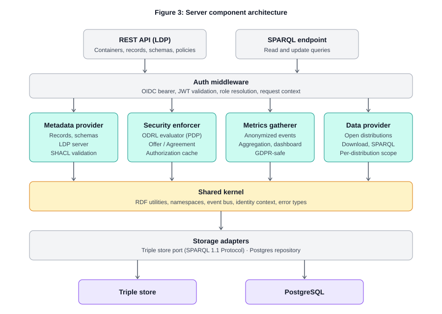

# FAIR Data Point v2 — Server

A FAIR-aligned metadata repository implementing the [FAIR Data Point specifications](https://specs.fairdatapoint.org), modelled on W3C DCAT with user-defined SHACL schemas, ODRL-based access control, and a full W3C Linked Data Platform API.

This repository contains the **server** implementation. The reference web client lives in a separate repository: `fdp-client` (URL to be set at repo creation).

> **Status: design phase.** This README describes the target architecture. Code in this repository is in active development and not yet ready for production deployment.

## What the FDP does

The FDP is a metadata repository. It serves descriptions of datasets, data services, organizations, biobanks, patient registries, scientific publications, methodologies, semantic artefacts — anything a community wishes to describe through its own SHACL schemas — over standard semantic-web protocols. Consumers can browse and search the metadata through a REST API (Linked Data Platform), run SPARQL queries against it, and access the underlying open-access data distributions where policy permits.

## Key design choices

- **Python + FastAPI** server, **Vue 3 + TypeScript** client, in **separate repositories**
- **External OIDC** for authentication — no internal user database
- **Modular monolith** with four bounded contexts: metadata provider, security enforcer, metrics gatherer, simple data provider
- **PostgreSQL** for operational state (metrics, auth cache, audit), **pluggable triple store** for RDF metadata
- **Full LDP** including `PATCH` for partial record updates
- **ODRL profile** (Permissions and Prohibitions) for access control; **versioned Offers**, **materialized Agreements** for audit
- **Anonymous-by-design metrics** — GDPR-safe by construction, not by policy
- **Deployment profiles** for community-specific schema and policy bundles

## Documentation

| Document | Purpose |
|---|---|
| [Architecture overview](docs/architecture/) | Full architecture design with diagrams |
| [Architecture Decision Records](docs/adr/) | Rationale for major architectural choices |
| API reference | Generated OpenAPI spec (link forthcoming) |
| Operator guide | Deployment, configuration, profile management (link forthcoming) |

## Architecture at a glance

The server exposes two HTTP surfaces — a REST/LDP API and a SPARQL endpoint — both sharing authentication, authorization, and a common storage layer:



See the [full architecture document](docs/architecture/README.md) for the data model, the SPARQL access-control flow, the ODRL policy lifecycle, and the deployment-profile mechanism.

## Repository layout

```
fdp-server/
├── README.md                       ← this file
├── docs/
│   ├── architecture/               ← architecture document and diagrams
│   │   ├── README.md
│   │   └── diagrams/
│   └── adr/                        ← architecture decision records
├── src/fdp/
│   ├── identity/                   ← OIDC integration, request context
│   ├── metadata/                   ← records, schemas, LDP server
│   ├── policy/                     ← ODRL evaluator, PDP, authorization cache
│   ├── access/                     ← SPARQL endpoint, query rewriting
│   ├── data/                       ← simple data provider
│   ├── metrics/                    ← anonymized event pipeline, dashboard API
│   ├── storage/                    ← triple store adapter, Postgres repository
│   ├── shared/                     ← RDF utilities, event bus, error types
│   └── main.py
├── tests/
│   ├── unit/
│   ├── integration/                ← testcontainers-backed triple store + Postgres
│   ├── contract/                   ← OpenAPI conformance
│   └── conformance/                ← FDP specs and LDP test suite
├── deploy/
│   ├── compose.yaml                ← dev stack: API + GraphDB + Postgres + Keycloak
│   └── helm/
└── pyproject.toml
```

## Technology stack

| Concern | Choice |
|---|---|
| Language | Python 3.12+ |
| Web framework | FastAPI |
| Validation at the edge | Pydantic v2 |
| RDF library | RDFLib (Oxigraph bindings considered for hot paths) |
| SHACL validation | pySHACL |
| OIDC | Authlib |
| ORM | SQLAlchemy 2.x (async) |
| Migrations | Alembic |
| Background jobs | arq (Postgres-backed) |
| Logging | structlog |
| Tracing | OpenTelemetry |
| Package management | uv |
| Testing | pytest, pytest-asyncio, testcontainers |

## Getting started (planned)

```bash
# clone, then:
docker compose -f deploy/compose.yaml up -d
uv sync
uv run alembic upgrade head
uv run fdp profile apply ./profiles/default
uv run fastapi dev src/fdp/main.py
```

The compose stack starts GraphDB, PostgreSQL, and a Keycloak instance pre-configured for local development. The default profile bootstraps a minimal FDP/DCAT setup; replace it with a community profile to bootstrap a custom deployment.

## License

To be determined. The current FDP reference implementation is Apache 2.0; the v2 implementation is expected to follow the same.

## See also

- FDP specifications: [specs.fairdatapoint.org](https://specs.fairdatapoint.org)
- Current reference implementation: [github.com/FAIRDataTeam/FAIRDataPoint](https://github.com/FAIRDataTeam/FAIRDataPoint)
- Reference client repository: `fdp-client` (URL to be set at repo creation)
