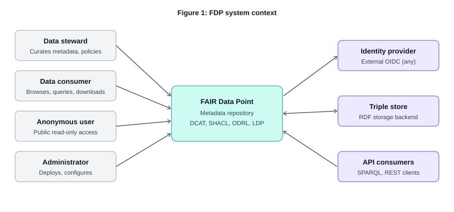
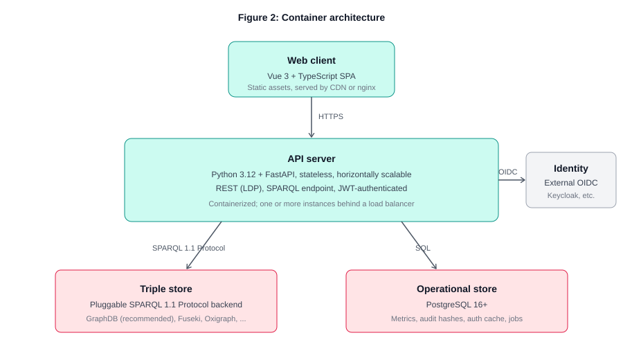
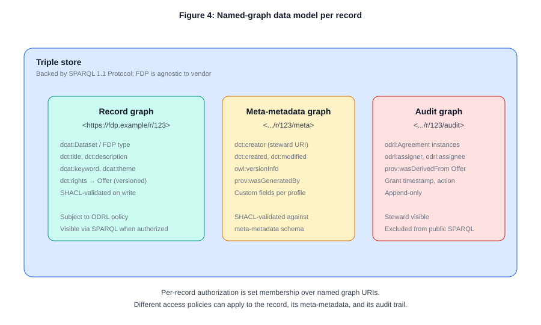
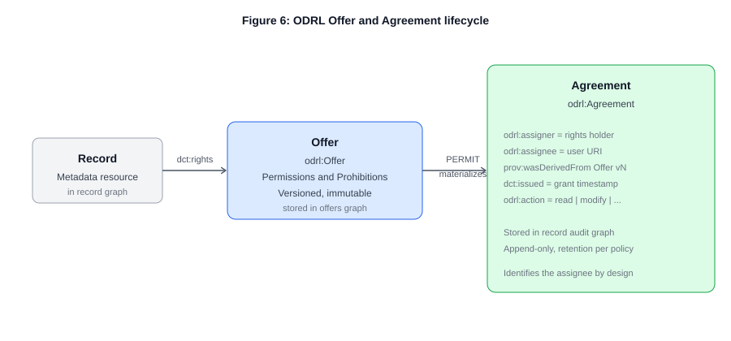
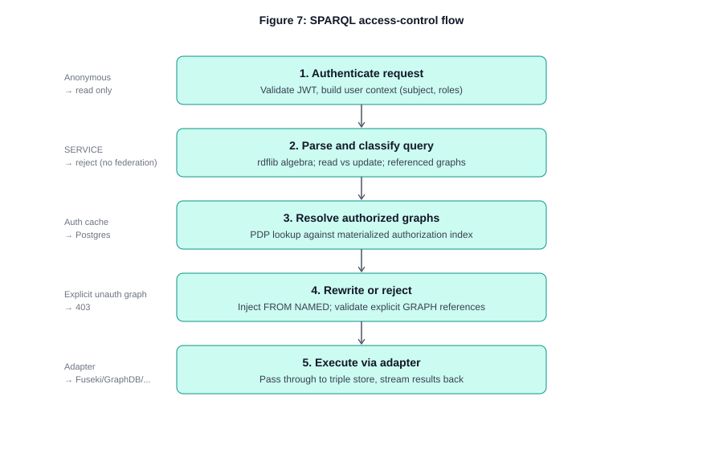
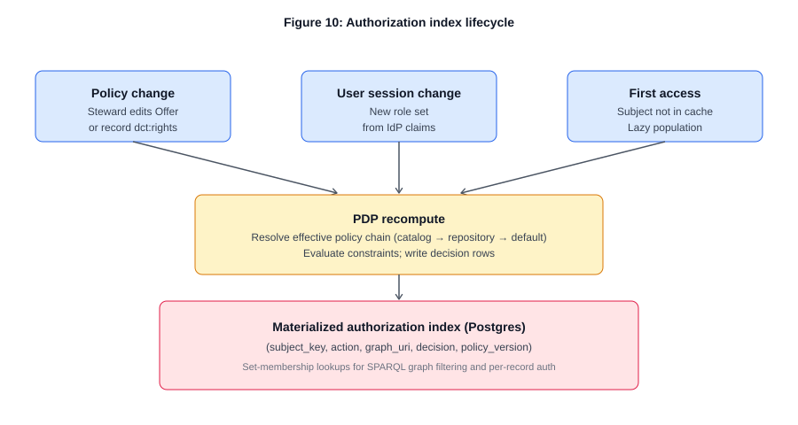
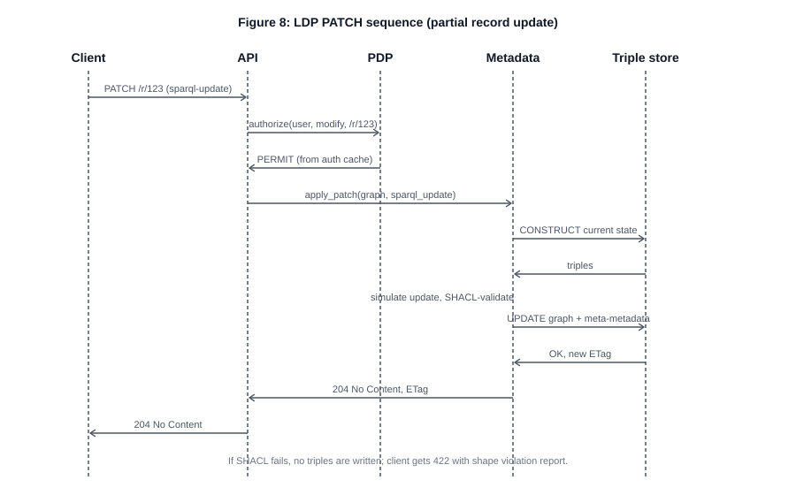
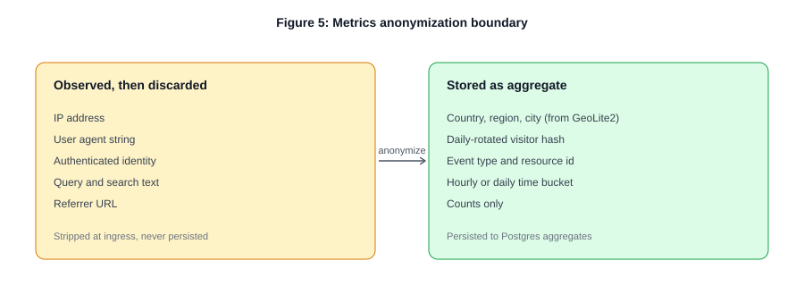
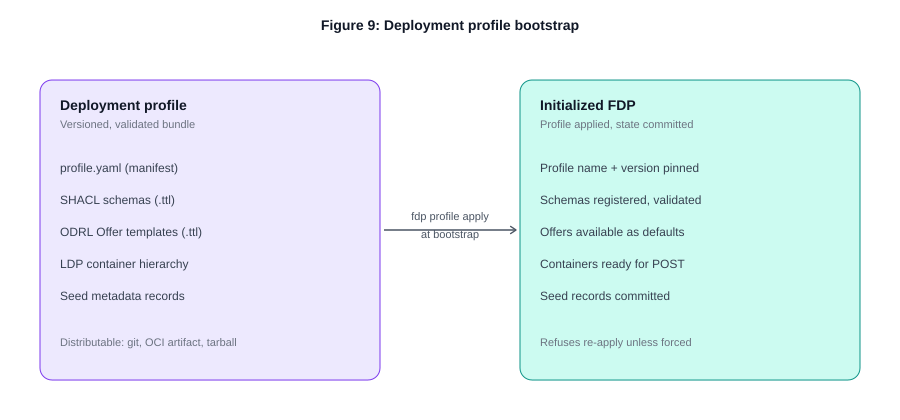

# FAIR Data Point v2 — Architecture

**Version:** 0.1 (Draft for review)
**Status:** Design phase
**Audience:** Engineers, system architects, FAIR community members planning deployments

This document specifies the architecture for the next generation of the FAIR Data Point (FDP), replacing the existing reference implementation at [github.com/FAIRDataTeam/FAIRDataPoint](https://github.com/FAIRDataTeam/FAIRDataPoint) with a modern, modular system aligned to the published FDP specifications at [specs.fairdatapoint.org](https://specs.fairdatapoint.org).

## Table of Contents

1. [Executive summary](#1-executive-summary)
2. [Goals and non-goals](#2-goals-and-non-goals)
3. [System context](#3-system-context)
4. [Container architecture](#4-container-architecture)
5. [Server components](#5-server-components)
6. [Data model](#6-data-model)
7. [Identity and authentication](#7-identity-and-authentication)
8. [ODRL policy model](#8-odrl-policy-model)
9. [SPARQL endpoint with access control](#9-sparql-endpoint-with-access-control)
10. [Linked Data Platform](#10-linked-data-platform)
11. [Metrics and privacy](#11-metrics-and-privacy)
12. [Deployment profiles](#12-deployment-profiles)
13. [Client application](#13-client-application)
14. [Cross-cutting concerns](#14-cross-cutting-concerns)
15. [Open questions](#15-open-questions)

For decision rationale, see the [Architecture Decision Records](../adr/).

---

## 1. Executive summary

This document specifies the architecture for the next generation of the FAIR Data Point. The redesign preserves the FDP's core mission — a FAIR-aligned metadata repository modelled on W3C DCAT, with user-defined SHACL schemas — and modernizes the implementation around several deliberate changes.

The current reference implementation has accumulated legacy from years of contributions by different teams. The new version drops internal user management in favour of OIDC-based federated identity, separates server and client into independent repositories, replaces partial Linked Data Platform support with full LDP including PATCH for partial updates, and introduces three capabilities the current implementation lacks: ODRL-based access control enforcement, anonymous-by-design usage metrics, and a simple data provider for open distributions.

The server is implemented in Python (FastAPI, RDFLib, pySHACL) as a modular monolith with four bounded contexts: metadata provider, security enforcer, metrics gatherer, and simple data provider. The client is a Vue 3 single-page application in TypeScript, including visual editors for SHACL schemas (functionally inspired by [ProjectOak](https://github.com/luizbonino/ProjectOak)) and ODRL policies. Operational state is stored in PostgreSQL; RDF metadata is stored in an operator-chosen triple store over SPARQL 1.1 Protocol, with GraphDB as the recommended default.

Three architectural decisions deserve attention up front. First, every metadata record lives in its own named graph, which reduces per-record access control to set membership over graph URIs and lets LDP PATCH map directly onto SPARQL Update. Second, ODRL access conditions are modelled as versioned Offers; grants materialize Agreements that reference the specific Offer version in force at grant time, giving a defensible audit trail. Third, the metrics pipeline strips personally identifying data at ingress — the metrics module is structurally incapable of producing user-identifying reports, satisfying GDPR by design rather than by policy.

The architecture intentionally excludes some features. There is no FDP-to-FDP federation: cross-FDP query is the responsibility of a future FDP Index service. There is no internal user database: identity is fully delegated to an external OIDC provider. The first version supports only open-access data distributions; access-controlled data delivery is a future increment.

---

## 2. Goals and non-goals

### 2.1 Goals

- Conform to the published FDP specifications at specs.fairdatapoint.org for metadata structure, vocabulary, and content negotiation.
- Support user-defined metadata schemas in SHACL, enabling description of entities beyond the DCAT-native types — organizations, biobanks, patient registries, scientific publications, methodologies, guidelines, semantic artefacts, and more.
- Delegate authentication to any OIDC-compliant identity provider; maintain no internal user database.
- Implement W3C Linked Data Platform fully, including containment, content negotiation, and PATCH for partial updates.
- Enforce access control on metadata records and schemas using W3C ODRL policies expressed as Offers, with Agreements materialized on grant for audit.
- Provide a SPARQL-compliant query endpoint exposed by the FDP API rather than by the triple store, with access control enforced at the query layer.
- Maintain customizable meta-metadata (record provenance, creator, version) governed by a SHACL schema that deployments can override.
- Gather usage metrics and expose them via API and dashboard, with privacy guarantees that satisfy GDPR by design.
- Provide simple open-access data distribution via the DCAT `downloadURL` and `accessURL` properties.
- Support community-specific deployments through versioned, validated deployment profiles — bundles of schemas, policies, container hierarchy, and seed records.
- Use Python for the server, TypeScript and Vue 3 for the client, in separate repositories with independent release cycles.
- Be deployable against a range of operator-chosen triple stores via SPARQL 1.1 Protocol.

### 2.2 Non-goals (v1)

- **FDP-to-FDP federation.** Cross-repository query is the responsibility of a future FDP Index service which will register and query individual FDPs.
- **Internal user management.** All identity, role assignment, and authentication flows are delegated to an external OIDC provider.
- **Access-controlled data distribution.** The simple data provider serves only distributions whose policy permits anonymous read; restricted data delivery is a future increment.
- **Property-level (sub-record) access control.** The unit of authorization is the named graph; finer-grained authorization is deferred.
- **ODRL Duty (obligation) enforcement.** The first version supports Permissions and Prohibitions only.
- **Profile migration.** Profile change after bootstrap requires a clean re-bootstrap; in-place migration is not provided.

---

## 3. System context

The FDP serves four user roles against three external systems. The user roles are defined functionally rather than by IdP-assigned identifiers: a single human can occupy multiple roles simultaneously, and the system maps IdP claims onto FDP-internal authorization decisions through ODRL constraints.



*Figure 1: FDP system context — four user roles, three external dependencies.*

### 3.1 User roles

**Data stewards** curate metadata. They create and edit records, manage SHACL schemas, author ODRL Offers, and curate the FDP's container hierarchy. Stewardship can be scoped to specific containers (a steward responsible for one catalog need not have write access to others); the scoping is expressed through ODRL constraints on the relevant Offers.

**Data consumers** browse, search, and query the metadata, and download or query the underlying data distributions where policy permits. Authenticated consumers may have access to records that are not publicly visible.

**Anonymous users** are unauthenticated consumers: they receive a request context with no identity and no roles, and the policy evaluator treats them as a single class. Anonymous access is read-only.

**Administrators** deploy and configure the FDP. They choose the triple store backend, configure the OIDC provider, apply deployment profiles, and tune system parameters. Administrators are not metadata users in the FDP-internal sense — their authority comes from the deployment environment, not from FDP-issued grants.

### 3.2 External dependencies

**Identity provider.** An external OIDC-compliant provider (Keycloak, Auth0, an institutional IdP). The FDP issues no tokens of its own and stores no passwords. The IdP returns role and group claims that the FDP's authorization context consumes. See [Section 7](#7-identity-and-authentication).

**Triple store.** An external RDF store communicating over SPARQL 1.1 Protocol. The operator chooses the backend; GraphDB is the recommended default for its administrative UI and proven scalability, but Fuseki and Oxigraph are tested alternatives. See [ADR-005](../adr/0005-triple-store-pluggability.md).

**API consumers.** Third-party clients consuming the FDP's REST and SPARQL APIs directly. They authenticate the same way the web client does — OIDC bearer tokens. The reference web client is one such consumer.

---

## 4. Container architecture

The deployment consists of three operator-managed services and one external dependency (the OIDC provider). The web client is delivered as static assets and can be served by the API service, a CDN, or a separate static-asset host; it executes entirely in the user's browser.



*Figure 2: Container architecture. Operator-managed units are the SPA, API server, triple store, and operational store.*

### 4.1 Web client

A Vue 3 single-page application written in TypeScript, built with Vite. It authenticates the user against the OIDC provider directly (Authorization Code flow with PKCE) and calls the FDP API with the resulting bearer token. The client renders all four user-facing surfaces: metadata browsing and search, the visual SHACL editor, the visual ODRL editor, and the metrics dashboard. It is stateless: all persistent state lives in the API and its backing stores.

### 4.2 API server

A Python 3.12+ FastAPI application. Stateless across requests, horizontally scalable behind a load balancer with no inter-instance coordination required (every request carries its own JWT, and any cache miss is acceptable because backing storage is shared). The server exposes two HTTP surfaces: the LDP-conformant REST API for metadata management, and the SPARQL endpoint for queries. Both share the same authentication middleware and the same policy decision point.

### 4.3 Triple store

An external RDF store. The FDP communicates with it exclusively through SPARQL 1.1 Protocol. The choice of backend is a deployment-time decision; the FDP server is configured with the SPARQL endpoint URL and credentials, and ships with adapters for three backends:

- **GraphDB** (recommended default): commercial-grade triple store with a mature administrative UI, strong SPARQL conformance, and good performance on the working-set sizes typical for FDP deployments.
- **Apache Jena Fuseki**: fully open source, widely deployed, zero-cost.
- **Oxigraph**: lightweight, easy to embed; appealing for development and small deployments.

Vendor-specific capabilities beyond SPARQL 1.1 Protocol (GraphDB repository management, named-graph cluster sync) sit behind capability flags so non-default adapters do not need to implement them.

### 4.4 Operational store (PostgreSQL)

A fixed component of the architecture. PostgreSQL 16+ stores everything operational: aggregated metrics, background-job state, the materialized authorization index used by the policy decision point, OIDC session bookkeeping, and an audit log of authorization decisions. None of this is part of the FDP's knowledge graph; the separation is enforced by design, so the triple store remains a pure metadata repository that can be dumped or migrated without operational noise.

The line is "is it metadata describing the repository's content or structure?" versus "is it runtime bookkeeping?". The triple store holds the knowledge graph **and** the FDP's own RDF configuration records — SHACL schemas, ODRL Offers, and resource definitions (the typed-resource registry; see [Section 12](#12-deployment-profiles) and [ADR-009](../adr/0009-runtime-resource-definitions.md)). It does **not** hold operational state, which is the Postgres list above. Resource definitions are stored as ordinary RDF records under a reserved internal namespace rather than in Postgres so they are versioned, exportable, and managed through the same LDP machinery as the records they describe.

Postgres is not optional. The architecture commits to it rather than treating it as one of several pluggable backends, because hard commitment removes a class of false-flexibility decisions (which connection pooler, which migration story per backend, which dialect of SQL) that distract from the FDP's actual job. See [ADR-003](../adr/0003-fixed-postgres-for-operational-state.md).

---
## 5. Server components

The API server is organized as a modular monolith. Four bounded contexts own discrete responsibilities and communicate through a small set of explicit interfaces. They share a runtime process and a shared kernel of cross-cutting utilities (RDF parsing, namespace registry, identity context, error types, in-process event bus) but maintain clean code-level boundaries so that any component can be lifted into a separate service later without rewriting the rest of the system. See [ADR-001](../adr/0001-modular-monolith.md) for the rationale.


*Figure 3: Server component architecture. Two HTTP entry points share authentication middleware and dispatch to four bounded contexts.*

### 5.1 HTTP entry points

Two entry points share the same FastAPI application:

**REST API (LDP).** A Linked Data Platform server (see [Section 10](#10-linked-data-platform)). Containers, records, schemas, and policies are all LDP resources. `GET` supports content negotiation across Turtle, JSON-LD, RDF/XML, and N-Triples. `POST` creates resources in containers. `PUT` replaces resources. `PATCH` applies SPARQL Update for partial modification. `DELETE` removes resources. The API surface is generated and documented through OpenAPI; the client uses the generated TypeScript types.

**SPARQL endpoint.** Conforms to the SPARQL 1.1 Protocol. Accepts queries via `GET` and `POST`, supports both standard result formats (XML, JSON, CSV, TSV) and RDF formats for `CONSTRUCT`/`DESCRIBE`. Updates are accepted from authenticated users with the appropriate ODRL grants; anonymous users may only issue read queries (`SELECT`, `ASK`, `CONSTRUCT`, `DESCRIBE`). The endpoint enforces graph-level access control through query rewriting, described in [Section 9](#9-sparql-endpoint-with-access-control).

### 5.2 Authentication middleware

All requests pass through a single authentication layer. The middleware:

- Extracts the bearer token from the `Authorization` header, if present.
- Validates the JWT signature against the OIDC provider's JWKS (cached with a short TTL). Invalid tokens are rejected with 401.
- Resolves the user context: subject identifier, group memberships, and role claims from the token. The IdP's claim names are configurable to accommodate different provider conventions.
- Attaches an immutable `RequestContext` to the request, containing the user identity (or the anonymous sentinel), the resolved roles, and the request timestamp. Downstream components read from this context; they never re-parse the token themselves.

There are no sessions. Every request is self-contained. Token refresh is the client's responsibility.

### 5.3 Metadata provider

Owns the lifecycle of metadata records and schemas. Implements the LDP server semantics: container management, content negotiation, ETag/`If-Match` concurrency control. SHACL validation runs on every write, both for the record content (against the schema declared by its container's `ldp:constrainedBy`) and for the meta-metadata block (against the configured meta-metadata schema).

Records are written to named graphs in the triple store via the storage adapter. The metadata provider does not evaluate policy directly; it delegates to the security enforcer through the explicit `authorize(subject, action, resource)` interface.

### 5.4 Security enforcer

The policy decision point. Reads ODRL Offers from the triple store, evaluates them against the request context, and returns `PERMIT` or `DENY` decisions. On `PERMIT`, it materializes an Agreement that records the assigner, assignee, the specific Offer version in force, the action, and the timestamp; the Agreement is written to the resource's audit graph.

The enforcer maintains a materialized authorization index in Postgres for performance — see [Section 9.4](#94-the-materialized-authorization-index). Other components never evaluate policy themselves; they always call into the enforcer. This keeps the policy semantics in one place and makes the enforcer the single audit-relevant component.

### 5.5 Metrics gatherer

Subscribes to events on the in-process event bus emitted by the other components: record views, downloads, search queries, SPARQL queries, login events. Each event passes through an anonymization layer before it reaches the gatherer ([Section 11](#11-metrics-and-privacy)). The gatherer aggregates events into hourly and daily counters in Postgres, and exposes a dashboard API the client consumes.

### 5.6 Simple data provider

Handles distribution access for open-access data. For RDF distributions exposed via `dcat:accessURL`, the provider exposes a SPARQL endpoint scoped to that distribution's data; for file distributions via `dcat:downloadURL`, it serves or redirects (operator configuration decides which). The provider is intentionally minimal in v1: it serves only distributions whose ODRL Offer permits anonymous read. Restricted distributions are recognized but not served; access-controlled data delivery is a v1.x increment.

### 5.7 Shared kernel

A thin layer of cross-cutting utilities: the RDF namespace registry, the request context type, the in-process event bus, generic error types, and structured-logging helpers. The shared kernel is the only code allowed to be imported from anywhere; component-to-component dependencies otherwise go through explicit interfaces.

### 5.8 Storage adapters

Two adapters mediate all I/O. The triple store adapter speaks SPARQL 1.1 Protocol and is the single point of contact with the RDF store; it exposes a small set of operations (`query`, `update`, `ingest_graph`, `replace_graph`, `drop_graph`) and is the seam at which different triple store backends plug in. The Postgres repository uses SQLAlchemy 2.x in async mode and is the single point of contact with the operational store.

---

## 6. Data model

The data model uses named graphs as the unit of organization. Every metadata record corresponds to exactly one named graph; the graph URI is the record's identifier. Two sibling graphs accompany each record graph: a meta-metadata graph holding provenance, and an audit graph holding the Agreements that have been issued against the record's Offer.



*Figure 4: Three named graphs per record — the record itself, its meta-metadata, and its audit trail.*

### 6.1 The one-graph-per-record invariant

This is the most consequential modelling decision in the architecture. It has three significant consequences:

- Per-record access control reduces to set membership over named-graph URIs. The PDP needs to answer "for this subject and this action, which graphs are allowed?" — a question the SPARQL dataset (`FROM NAMED` clauses) can express directly.
- LDP `PATCH` maps cleanly onto SPARQL Update. The record URL identifies its graph; an update is a SPARQL Update implicitly scoped to that graph.
- Replacing or deleting a record is a graph-level operation, not a triple-level diff.

The trade-off is that records cannot share triples. A statement like "Dataset X is part of Catalog Y" appears in the dataset's graph (as `<X> dct:isPartOf <Y>`) rather than as a free-standing assertion. This is acceptable for the FDP's data model because the FDP hierarchy is naturally tree-shaped. See [ADR-007](../adr/0007-one-graph-per-record.md).

### 6.2 Meta-metadata

Each record has a sibling meta-metadata graph at a deterministic URI (the record graph URI suffixed with `/meta`). It contains the record's provenance: who created it, when, the current version, and any custom fields the deployment chose to track. The meta-metadata graph has its own SHACL schema; the FDP ships a default that can be replaced as part of a deployment profile.

Meta-metadata is created and updated by the FDP itself on every write — it is never directly editable by clients. This is important: meta-metadata is the authoritative record of who did what, and allowing client writes would undermine its audit value. The default schema includes:

- `dct:creator` (set from the authenticated user)
- `dct:created` (set on first write)
- `dct:modified` (updated on every write)
- `owl:versionInfo` (incremented on every write)
- `prov:wasGeneratedBy` linking to a `prov:Activity` describing the operation

Profiles can extend the schema to require additional fields specific to a community's reporting needs.

### 6.3 Audit graphs

Each record has a sibling audit graph at the URI suffixed with `/audit`, containing the ODRL Agreements materialized whenever a grant is issued against the record's Offer. Audit graphs are append-only — entries are never modified or deleted within the FDP's normal operation. The retention policy is operator-configurable; in jurisdictions with a right-to-erasure obligation, an administrative endpoint can scrub identifying details from individual entries while preserving the structural record that an access was granted.

Audit graphs are not visible to anonymous users and are filtered from the public SPARQL dataset. Stewards see audit entries for records they own; administrators see everything.

### 6.4 Container graphs

LDP containers are themselves RDF resources and have their own graphs, following the same one-graph-per-resource invariant. A container's graph contains its own metadata (title, description, `ldp:constrainedBy` pointing to the schema for its members) and the LDP membership triples linking it to its members.

### 6.5 Internal graphs and the public dataset

Some graphs are part of the FDP's machinery rather than its publicly queryable knowledge graph: meta-metadata graphs (`…/meta`), audit graphs (`…/audit`), and the resource-definition records that make up the typed-resource registry (under the reserved `…/resource-definitions/` namespace; see [Section 12](#12-deployment-profiles)). These share a **single, structural definition** of "internal": one set of reserved graph-URI patterns that both the SPARQL dataset construction ([Section 9.3](#93-query-rewriting)) and the authorization layer consult. The dataset builder always excludes internal graphs from the public/default dataset, and the authorization index never grants `read` on them to non-admin subjects. Keeping this as one shared set — rather than per-feature filtering — means there is exactly one place to get it right and one place to test that internal data never leaks into a knowledge-graph query. See [ADR-009](../adr/0009-runtime-resource-definitions.md).

---

## 7. Identity and authentication

The FDP delegates all authentication to an external OIDC-compliant identity provider. It has no user table, no password storage, no registration flow, and no concept of "creating a user" through its own API.

### 7.1 Authentication flow

The web client uses the OIDC Authorization Code flow with PKCE, communicating directly with the IdP. The user authenticates against the IdP and the client receives an access token (JWT) plus an ID token. The client includes the access token as a bearer in every API request; the server validates the JWT signature against the IdP's published JWKS.

API consumers may use the same Authorization Code flow with PKCE, or — for service-to-service usage — the Client Credentials flow. Either way the FDP server sees only a JWT and validates it the same way.

### 7.2 User identity within the FDP

A user is identified by the JWT `sub` claim (the IdP's subject identifier), namespaced by the issuer URL. This composite identifier appears as a URI in ODRL `assignee` references and in meta-metadata `dct:creator` triples. Display name, email, and other profile attributes are read from the token but never persisted by the server — they are looked up fresh from the token on every request.

### 7.3 Roles and groups

The FDP consumes role and group claims from the JWT. The claim names are configurable; conventional defaults match Keycloak and Auth0 conventions (`realm_access.roles` and `groups`). The auth middleware resolves these into a frozen set of role URIs that downstream components use in ODRL constraint evaluation.

The FDP defines no global role model. A deployment profile may declare a vocabulary of expected roles for its community (e.g., `community:biobank-admin`, `community:data-steward`) and reference them in seed Offers, but the FDP itself does not. Mapping IdP claims to FDP-internal roles is therefore a configuration concern, not a code concern.

### 7.4 The authentication-authorization split

Authentication tells the FDP *who* the user is. Authorization tells the FDP *what* the user may do. The IdP handles only the former. All authorization decisions are made by the FDP's security enforcer, against ODRL policies stored alongside the metadata they protect. This separation lets the same FDP work with any OIDC provider without bespoke configuration per provider.

---

## 8. ODRL policy model

Access conditions on metadata records and schemas are expressed in W3C ODRL. The FDP defines a profile — a documented subset of ODRL — that policies must conform to; policies using features outside the profile are rejected. The profile keeps the policy surface manageable, the evaluator simple, and the visual editor coherent.

See [ADR-006](../adr/0006-odrl-profile-permission-prohibition.md) for the rationale on the profile scope.

### 8.1 The FDP ODRL profile

**Supported policy types:** `odrl:Offer` and `odrl:Agreement`. Other policy types (`odrl:Set`, `odrl:Policy`, `odrl:Privacy`, `odrl:Request`, `odrl:Ticket`, `odrl:Assertion`) are not used.

**Supported rules:** `odrl:Permission` and `odrl:Prohibition`. Duties (obligations such as "must cite") are not supported in v1; expressing them would mislead stewards into thinking they will be enforced, when no workflow exists to follow up on obligations.

**Action vocabulary:**

| Action | Use |
|---|---|
| `odrl:read` | View a metadata record or schema |
| `odrl:modify` | Update a metadata record or schema |
| `odrl:delete` | Remove a metadata record or schema |
| `odrl:distribute` | Download or query a data distribution (simple data provider) |

**Supported constraints:** party identity (assignee equals a specific URI), role membership (assignee has a specific role URI), organization/group membership (assignee belongs to a specific group), and time windows (`odrl:dateTime` with `lt`, `gt`, `eq`, `lteq`, `gteq` operators).

**Excluded constraints:** purpose (no technical way to verify a user's purpose), spatial (would require per-request geo data, conflicting with the metrics privacy design), industry, payment, count, percentage. These can be re-evaluated for v2 if real use cases emerge.

### 8.2 Offer and Agreement lifecycle

A record's access conditions are expressed as an `odrl:Offer`. Offers are versioned and immutable: when a steward edits access conditions, a new Offer version is created, the record's `dct:rights` is updated to point to the new version, and the previous versions are preserved. Offer versioning is what makes audit work — an Agreement can reference the exact Offer version in force at grant time, even after the steward later changes the conditions.



*Figure 5: A record's `dct:rights` points to an immutable, versioned Offer. On PERMIT, the PDP materializes an Agreement that references the specific Offer version.*

When the policy decision point returns `PERMIT`, it materializes an `odrl:Agreement` containing:

- `odrl:assigner` — the rights holder, derived from the record's parent catalog
- `odrl:assignee` — the user URI (from the JWT subject)
- `prov:wasDerivedFrom` — the specific Offer version in force
- `dct:issued` — the grant timestamp
- `odrl:action` — the action that was permitted

Agreements live in the record's audit graph (see [Section 6.3](#63-audit-graphs)). They are by design identified — that is their audit purpose. This is distinct from and complementary to the metrics pipeline, which is by design anonymous.

### 8.3 Policy inheritance

ODRL itself defines no inheritance semantics, but the FDP needs them — most records will not carry their own policy and should fall back to a sensible default.

A record without `dct:rights` inherits from its parent container in the FDP hierarchy: dataset inherits from catalog, catalog inherits from repository, repository inherits from the system default. The system default is configured at deploy time (or by the deployment profile) — typically "public read, authenticated steward modify". Inheritance walks up on lookup, not down on write. We do not propagate policy changes down a subtree, because that obscures what is actually in effect on a given record — every record's effective policy can be discovered by walking up the chain.

### 8.4 Conflict resolution

The default is **deny wins**: if a Permission and a Prohibition both apply to the same action, the Prohibition wins. ODRL supports overriding this with `odrl:conflict odrl:perm` (permission wins) or `odrl:conflict odrl:invalid` (whole policy is rejected). The FDP supports the override at the policy level but makes the safe default explicit in documentation and in the visual editor's UI defaults.

### 8.5 Evaluation algorithm

The PDP algorithm is small:

1. Build a request context: subject identity, role set, action, resource, current time.
2. Resolve the effective policy by walking the inheritance chain.
3. Filter rules to those whose action matches the requested action.
4. Evaluate each remaining rule's constraints against the context.
5. Collect rule outcomes, apply the conflict strategy.
6. Return `PERMIT` or `DENY`.

Decisions are logged to Postgres for audit — what was decided, why (which rule fired), against what Offer version — but never with the user's identity in a queryable form. The audit log uses the same daily-rotated hash the metrics pipeline uses, so it is useful for "did the system behave correctly" but not for "what did user X do". User-identifying audit information lives in the materialized Agreements in audit graphs, where it is part of the contract of access.

### 8.6 Policies and licenses as first-class managed documents

The Offers above are not anonymous fragments embedded only inside the records they govern. ODRL **policies** and **licenses** are managed as first-class RDF documents — the same treatment SHACL schemas receive (Section 10.1) — so the visual editor has a real backend and an FDP can serve as a **reference source** of access conditions and licenses that other FDPs discover and reference. See [ADR-0012](../adr/0012-first-class-odrl-policy-and-license-documents.md).

There are **two separate subsystems**:

- **`/policies`** — `odrl:Offer` documents, validated against the FDP ODRL profile (§8.1) and **enforced** by the PDP. A record opts into one via `dct:rights`; the offer resolver fetches it by IRI (§8.2/§8.3 are unchanged for local references).
- **`/licenses`** — license documents (an `odrl:Set`/`odrl:Policy` license expression or a `dct:LicenseDocument`), validated against a license SHACL shape and referenced **descriptively** via `dct:license`. The PEP never evaluates them.

Each is stored one-graph-per-record at a reserved, dereferenceable deployment IRI — `{base}/policies/{id}` and `{base}/licenses/{id}`, mirroring `{base}/schemas/{id}` — with its own descriptive metadata and meta-metadata sibling, runtime CRUD over an admin API, and the Section 12 publication-state lifecycle (draft → published → archived). The one policy-specific lifecycle rule: an **archived policy is retained and still enforced for records that already reference it**, but is not offered for new assignment, so archiving never silently breaks dependents. Published documents are indexed in search (Section 7) as `policy`/`license` content types and surface in the discovery catalogs.

Cross-FDP reuse is delivered as **publish-and-discover** now — stable dereferenceable IRIs, discovery catalogs, search, and (when Phase 8 ships) Index harvesting — while actively dereferencing and **enforcing a remote FDP's policy** at decision time is deferred to an opt-in, allow-listed extension, the same posture as remote schema sync.

---

## 9. SPARQL endpoint with access control

The FDP exposes a SPARQL-compliant endpoint at `/sparql`. It is not a direct passthrough to the triple store: it parses every query, enforces access control by query rewriting, and only then dispatches to the storage adapter.

There are three plausible approaches to constraining SPARQL queries to authorized data, and each fails in a different way:

- **Result filtering** — run the query, drop disallowed rows — breaks `COUNT` and aggregations and leaks information through cardinality.
- **`FILTER`-based rewriting** has edge cases around `OPTIONAL`, `MINUS`, and nested `SELECT` where the filter scope is not where it intuitively should be.
- **Named-graph projection** — enumerate the user's authorized graph set upfront, inject `FROM NAMED` clauses constraining the dataset — survives review. SPARQL's dataset semantics handle the rest: aggregates, `OPTIONAL`, everything behaves correctly because the engine sees only the authorized graphs.

The FDP uses named-graph projection. This is why the one-graph-per-record invariant matters so much — it makes per-record authorization fall out of dataset definition for free. See [ADR-004](../adr/0004-sparql-access-via-named-graph-projection.md).



*Figure 6: SPARQL queries pass through five steps from authentication to execution.*

### 9.1 Parsing and classification

Queries are parsed into algebra trees using RDFLib. The top-level node tells us the query form:

- **Reads**: `SELECT`, `ASK`, `CONSTRUCT`, `DESCRIBE`
- **Updates**: `INSERT`, `DELETE`, `LOAD`, `CLEAR`, `CREATE`, `DROP`, `COPY`, `MOVE`, `ADD`

Anonymous users sending updates are rejected at this step. Authenticated users continue, and per-graph `odrl:modify` checks happen in the rewriting step.

### 9.2 SERVICE clauses are rejected

The FDP does not support FDP-to-FDP federation (see [Section 2.2](#22-non-goals-v1)). Queries containing `SERVICE` clauses are rejected at parse time with a clear error message. Cross-FDP federation is the responsibility of the future FDP Index service.

### 9.3 Query rewriting

For read queries, the rewriter injects `FROM NAMED <g>` clauses for every graph `g` in the user's authorized read set, intersected with any graphs the query explicitly references. For update queries with explicit `WITH <graph>` or `GRAPH <uri>` blocks, the targets are validated against the authorized modify set.

Internal graphs (meta-metadata, audit, and resource-definition records — see [Section 6.5](#65-internal-graphs-and-the-public-dataset)) are never in a non-admin subject's authorized set and are excluded from the default dataset, so a knowledge-graph query cannot return them. The exclusion uses the single shared set of reserved internal-graph patterns, not per-query logic.

Updates of the form `DELETE { ?s ?p ?o } WHERE { ... }` without explicit graph specification are restricted in v1: they are rejected with an error message that explains how to rewrite the query with explicit graph targets. This is a real ergonomic cost on power users, but the alternative — running the `WHERE` in dry-run mode to enumerate target graphs before authorization — has its own information-leakage issues and is deferred. Updates issued through LDP `PATCH` are not subject to this restriction because the target graph is implicit in the resource URL.

### 9.4 The materialized authorization index

Evaluating an ODRL policy for every (user, graph) pair on every query would be prohibitively expensive. The security enforcer maintains a materialized authorization index in Postgres:

```
(subject_key, action, graph_uri, decision, policy_version)
```

The `subject_key` is the user URI plus a hash of their current role set for authenticated users, and a constant for anonymous. The index is recomputed lazily — on first access for an unseen `subject_key`, and invalidated when a policy changes (recompute affected rows), a record's policy reference changes (recompute that graph's column), or a user's roles change between sessions (drop their rows). A short TTL on top of that catches anything we missed.



*Figure 7: The materialized authorization index is recomputed on policy change, user-session change, or first access by an unseen subject.*

There is a consistency window during invalidation. For tightening (record becomes more restricted), we make the invalidation synchronous on the policy write, accepting the latency cost. For loosening, eventual consistency is acceptable.

### 9.5 Information-leakage rules

If the query names a graph the user cannot see — explicitly mentions it in `FROM`, `FROM NAMED`, or a `GRAPH <uri>` block — we return 403 with a "not authorized for graph X" message. The user already asserted knowledge of that URI by typing it, so confirming "you cannot have it" leaks nothing new.

If the query does not name specific graphs, we silently constrain to the authorized set and return whatever matches. The user gets answers from what they can see and has no way to distinguish "no such record exists" from "exists but you cannot see it" — which is the desired property.

Timing-channel leaks (a query taking longer if more records existed but were filtered) are mitigated by the materialized index meaning the filter is set membership against pre-computed data, not per-record policy evaluation.

---
## 10. Linked Data Platform

The current FDP reference implementation uses only the containment portion of LDP. The new version implements LDP fully, which removes the need for a hand-rolled REST CRUD API and gives clients standard, predictable semantics for working with metadata. See [ADR-008](../adr/0008-full-ldp-with-patch.md).

### 10.1 Container hierarchy

The FDP hierarchy maps to LDP Direct Containers:

- The Repository container holds Catalogs
- Each Catalog container holds Datasets and Data Services
- Each Dataset container holds Distributions
- Custom container types added by deployment profiles slot in alongside, with their own membership semantics

Each container links via `ldp:constrainedBy` to the SHACL schema its members must satisfy. A `POST` that does not validate against the constraint is rejected with a 422 and a reference to the violated shape.

### 10.2 HTTP methods

| Method | Semantics |
|---|---|
| `GET` on a resource | Returns the RDF graph for that resource. Content negotiation across Turtle, JSON-LD, RDF/XML, N-Triples. |
| `GET` on a container | Returns the container's membership triples and metadata. |
| `HEAD` | Same as `GET` without the body. Used by clients to check ETag and Allow. |
| `POST` to a container | Creates a new member. Server mints a URI (or honors a `Slug` header). |
| `PUT` to a resource | Replaces the resource. ETag concurrency via `If-Match` is required. |
| `PATCH` to a resource | Partial update. Body is `application/sparql-update`. |
| `DELETE` on a resource | Removes the resource (and its meta-metadata graph; audit graph is preserved). |
| `OPTIONS` | Returns the methods allowed on the resource. |

`Link` headers advertise LDP types (`ldp:Resource`, `ldp:RDFSource`, `ldp:DirectContainer`). `Allow` headers list supported methods. ETags plus `If-Match` give optimistic concurrency control essentially for free.

### 10.3 PATCH and partial updates

`PATCH` is the change relative to the current reference implementation. It lets a client modify part of a record without retrieving the whole record, modifying it, and resubmitting. The body is a SPARQL Update, content type `application/sparql-update`, implicitly scoped to the resource's graph.

For example, to add a keyword to a dataset:

```http
PATCH /catalogs/c1/datasets/d1 HTTP/1.1
Content-Type: application/sparql-update
Authorization: Bearer <token>
If-Match: "abc123"

INSERT DATA { <> dcat:keyword "diabetes" }
```

The implicit `<>` refers to the resource URL. The server runs this through the same parser and authorization pipeline as the SPARQL endpoint, but with two simplifications: the target graph is fixed by the URL, and the user only needs `odrl:modify` on that one graph.



*Figure 8: LDP PATCH sequence. The same authorization pipeline as the SPARQL endpoint; the URL fixes the target graph; SHACL validation runs against the simulated post-update state.*

The metadata module simulates the update against the current record state, validates the result against the schema, and only commits to the triple store if validation passes. Meta-metadata (`dct:modified`, `owl:versionInfo`, the new `prov:Activity`) is updated atomically with the record.

### 10.4 Property-level access control is out of scope (v1)

If you have `odrl:modify` on the record, you can `PATCH` any property. Going finer-grained means evaluating ODRL constraints against individual triples, which gets expensive and gets semantically weird (what is the assignee of a property?). The path for v2, if needed, is sub-policies attached to schema fragments — not in v1.

---

## 11. Metrics and privacy

The metrics gatherer is privacy-by-design. The architecture commits structurally to never seeing personally identifiable data, rather than relying on policy to delete it after the fact. See [ADR-002](../adr/0002-anonymous-metrics.md).

### 11.1 The anonymization boundary

Each module emits events to the in-process event bus, but before the event reaches the metrics handler, an anonymization layer transforms the request context. IPs are looked up against the embedded MaxMind GeoLite2 database to derive country/region/city and then **dropped before the event is queued**. User identity is stripped — the metrics module has no way to query "what did user X do", because that information is not in its inputs.



*Figure 9: Sensitive data is observed in flight and discarded at the anonymization boundary; only aggregate-safe data crosses into storage.*

| Observed, then discarded | Stored as aggregate |
|---|---|
| IP address | Country, region, city (from GeoLite2) |
| User agent string | Daily-rotated visitor hash |
| Authenticated identity | Event type and resource id |
| Query and search text | Hourly or daily time bucket |
| Referrer URL | Counts only |

### 11.2 Visitor counting without tracking

Unique visitor counts use a daily-rotated salted hash of IP+UA — the approach Plausible and Fathom use. Within a 24-hour window, the same visitor hashes the same way (so we can count distinct visitors per day). Across days, the same person hashes differently, so no longitudinal tracking is possible.

The salt is held only in memory and rotated every 24 hours; it is never written to disk. A strict reading of GDPR can still classify a daily hash as a pseudonymous identifier, so the privacy notice documents this clearly and administrators have a config flag to disable unique-visitor counting entirely if their legal context requires it.

### 11.3 Why query text is not stored

Search queries and SPARQL queries can be deeply identifying — someone searching their own name, a rare disease, or an unpublished dataset reveals a lot. Metrics tracks that a search or SPARQL query happened, against which endpoint, and how long it took. Not what was asked.

If a future "top searches" feature is added, it requires k-anonymity (only show a term if at least *k* distinct daily-hashes searched it in a period) and a short retention window, and adding it is a separate decision with its own data protection impact assessment.

### 11.4 No analytics cookies

The metrics pipeline does not set any cookies. The OIDC session may set its own cookie depending on the IdP configuration, but that is a separate concern. No cookie banner is needed for analytics purposes.

### 11.5 Retention

Raw events are aggregated to hourly buckets within minutes and discarded. Hourly buckets roll up to daily after 48 hours. Postgres holds only aggregates past that point, so even if there were a re-identification risk, the source data is not around to re-identify against.

### 11.6 What the dashboard shows

- Per-record and per-schema views and downloads
- SPARQL query counts and latency distributions
- Geographic distribution of visitors
- Unique visitors per day
- Time-of-day patterns
- Top resource types

Stewards see metrics for resources they own; administrators see system-wide.

---

## 12. Deployment profiles

Communities deploying FDPs often need a custom set of metadata schemas — descriptions of biobanks, patient registries, methodologies — rather than (or in addition to) the standard DCAT-based defaults. The FDP supports this through versioned, validated **deployment profiles**.

### 12.1 What a profile contains

A profile is a bundle:

- **Manifest** (`profile.yaml`): name, version, optional parent profile to extend
- **SHACL schemas** (`.ttl` files): the metadata schemas the deployment will use
- **ODRL Offer templates** (`.ttl` files): default access policies
- **Container hierarchy**: the LDP container structure to bootstrap
- **Seed metadata records**: pre-populated entries



*Figure 10: A profile bundle becomes an initialized FDP at bootstrap.*

The FDP ships with a built-in default profile containing the standard FDP/DCAT schemas (Repository, Catalog, Dataset, DataService, Distribution) and a minimal seed populated from deployment config. Community profiles can replace the default entirely or, more commonly, import it and extend — adding biobank, sample, patient-registry, or publication types while keeping DCAT compatibility for federation with the future FDP Index.

The profile's `resourceDefinitions` — the registry of typed resources and the child links between them — are the **seed** of the FDP's typed-resource registry, not its permanent definition. At bootstrap they are written into the triple store as RDF records (one named graph each, under the reserved `…/resource-definitions/` namespace); thereafter they are runtime-mutable through an admin API without re-bootstrap. Adding an `Ontology` type and making Catalogs contain Ontologies is a runtime curation act — register a SHACL shape, then register a resource definition that points at it and add a child link from the Catalog definition — and the LDP endpoints and OpenAPI surface for the new type appear immediately, with no restart. See [ADR-009](../adr/0009-runtime-resource-definitions.md).

Describing a type (a SHACL shape) and exposing it (a resource definition) are kept **separate**, mirroring the reference implementation: publishing a shape never auto-exposes a type, so draft and reusable (`sh:node`) shapes don't leak into the URL space. The two-step flow is therefore: (1) publish the shape as an ordinary LDP record at a deployment-relative IRI (e.g. `{base}/shapes/Ontology`) so it is itself versioned and manageable through the API; (2) `POST` a resource definition whose `schema` points at that shape IRI. The admin API rejects a definition whose `schema` does not resolve to a published SHACL shape, so the steps cannot be done out of order. Schema *lifecycle* (versioning, release) beyond create is a separate concern tracked with the client's schema-management surface.

### 12.2 Bootstrap behavior

At startup the FDP checks Postgres for a "profile applied" marker:

- **Uninitialized**: load the configured profile, validate (SHACL shapes parse, ODRL Offers conform to the FDP profile, seed records validate against their declared schemas, container references resolve, imports are present), then apply in dependency order — schemas first, then containers with their `ldp:constrainedBy` links, then offers, then seed records with their `dct:rights` resolved to seeded offers. The profile name and version are recorded in Postgres and embedded in the meta-metadata of each seeded record.
- **Already initialized**: the profile is not re-applied; the FDP runs normally. The profile is applied exactly once per deployment lifetime.

If validation fails the FDP refuses to start — no partial bootstrap state.

### 12.3 Profile change requires re-bootstrap

Once applied, the FDP refuses to apply another profile on top unless explicitly forced via an admin CLI command. Force-apply means wiping the triple store and Postgres operational state and starting from a clean slate. Migrating between profiles in place is not a v1 feature — schema evolution after bootstrap goes through the normal runtime API, which already supports versioning through meta-metadata.

This applies to the *bootstrap profile bundle*. It does not mean the set of types is frozen: resource definitions and their child links are runtime-mutable through the admin API (see [Section 12.1](#121-what-a-profile-contains) and [ADR-009](../adr/0009-runtime-resource-definitions.md)). Re-bootstrap is only needed to swap the whole seed bundle, not to add or re-parent a type.

### 12.4 Profiles authored using the FDP

A nice symmetry: stewards can author profiles using the FDP itself. Stand up a development FDP, build schemas in the visual SHACL editor, define Offers in the ODRL editor, add seed records through the LDP API, then run `fdp profile export` to package the current state (excluding meta-metadata, audit graphs, agreements, and metrics) as a distributable profile. Other deployments install that profile at bootstrap.

### 12.5 CLI

The FDP CLI exposes four profile commands:

| Command | Purpose |
|---|---|
| `fdp profile validate <path>` | Dry-run validation of a profile bundle |
| `fdp profile apply <path>` | Bootstrap (refuses if already initialized) |
| `fdp profile info` | Show the applied profile name and version |
| `fdp profile export <path>` | Serialize current state to a portable profile |

---

## 13. Client application

The web client is a Vue 3 single-page application in TypeScript, maintained in its own repository (`fdp-client`, separate from this server repository). It is the reference client for the FDP API but not the only possible client — third parties can implement their own.

### 13.1 Technology choices

| Concern | Choice |
|---|---|
| Framework | Vue 3 (Composition API) |
| Language | TypeScript 5 (strict mode) |
| Build | Vite |
| State | Pinia |
| Server cache | TanStack Query (Vue) |
| OIDC client | `oidc-client-ts` |
| Components | PrimeVue (utility components and forms) |
| Diagram canvas | Vue Flow (SHACL and ODRL editors) |
| Routing | Vue Router |
| HTTP | Axios with interceptors for auth |
| API types | Generated from the server's OpenAPI spec via `openapi-typescript` |
| Testing | Vitest, Playwright |

### 13.2 Application structure

The application is organized into four major surfaces:

**Metadata browsing and search.** Catalog tree navigation, record detail views with full RDF content available in multiple serializations, faceted search across the metadata, free-text search, SPARQL query playground for advanced users.

**Visual SHACL editor.** A node-based canvas for defining and editing SHACL schemas. Each shape is a node; properties and constraints sit on the node; relationships between shapes (`sh:node`, `sh:class`) are edges. Live preview of the serialized SHACL, validation against test data, import/export of `.ttl`. Functionally inspired by [ProjectOak](https://github.com/luizbonino/ProjectOak); the UX is designed against the rest of the client, not a direct copy.

**Visual ODRL editor.** A guided form-based editor for authoring Offers within the FDP profile. Steward picks the action(s), adds constraints (party identity, role, organization, time window) from the supported vocabulary, chooses conflict strategy. Live preview of the resulting `.ttl`. The editor refuses to construct policies outside the FDP profile — communities considering broader ODRL features should know in advance that they will be rejected by the server.

**Metrics dashboard.** Charts, time-series, and top-N lists rendered from the dashboard API. Per-resource drill-down for stewards. No raw data export, in keeping with the privacy design.

### 13.3 Authentication flow

The client uses the OIDC Authorization Code flow with PKCE via `oidc-client-ts`. The library handles redirect, code exchange, token storage (memory by default; sessionStorage if the user opts in to "remember me" within the session), automatic refresh, and silent renewal where the IdP supports it.

The Axios interceptor adds the bearer to every API request. On 401 it attempts a silent renew once before propagating the error to the application.

### 13.4 Why a separate repository

Server and client release independently. Server has Python tooling, client has Node tooling. CI configurations differ. Test infrastructure differs. Issue triage differs. Keeping them in one repo would mean every contributor needs both toolchains, and every change to the client retriggers server CI. The cost of separation is coordinating across two PRs when an API and client change need to ship together; the OpenAPI-generated types make the contract explicit and catch contract breaks at compile time on the client side.

---

## 14. Cross-cutting concerns

### 14.1 Observability

Structured logging via `structlog`. Every log line carries the request ID, the resolved user identity (or anonymous), the resource being accessed, and the outcome. OpenTelemetry traces propagate through the HTTP entry points, the storage adapters, and the Postgres connection pool. Metrics on internal operations (cache hit rates, validation durations, policy evaluation latency) flow to a Prometheus-compatible endpoint at `/internal/metrics`; this is **not** the user-facing metrics dashboard, which has its own dedicated API.

### 14.2 Configuration

Configuration is layered: built-in defaults, then a YAML configuration file, then environment variables (which override the file). Secrets are referenced by name and resolved from environment or a secret backend (file-mounted secrets, HashiCorp Vault) at startup. No secret values appear in the configuration file checked into version control.

### 14.3 Errors

Errors carry a stable code, a human-readable message, and a documentation URL. The OpenAPI schema declares the error envelope. Validation errors (SHACL violations, ODRL profile violations) return a structured report listing each violation with a pointer to the offending shape or constraint.

### 14.4 Concurrency control

ETags + `If-Match` for LDP write operations. The triple store adapter is responsible for ETag computation (typically a hash of the graph's canonicalized N-Triples). Conflicting writes return 412 Precondition Failed.

### 14.5 Background jobs

Some operations are too slow to run synchronously: profile bootstrap, large bulk imports, schema-change re-validation across affected records. The FDP runs a small worker pool (in-process via `arq` or a similar async job library, backed by Postgres `LISTEN`/`NOTIFY`) and exposes job status via the API. No external broker (Redis, RabbitMQ) is required; Postgres is sufficient for this workload.

### 14.6 Deployment

The FDP ships as a container image and a Helm chart. The Helm chart deploys the API server (replicated), the bundled migration job, and references external triple store and Postgres services that the operator brings. A docker-compose file in the repository provides a single-command development setup with GraphDB, Postgres, and Keycloak.

### 14.7 Testing

Test pyramid:

- **Unit tests** for individual components and the policy evaluator
- **Integration tests** for component-to-component flows (metadata provider with the policy enforcer and the storage adapter, using testcontainers-launched GraphDB/Fuseki/Oxigraph instances)
- **Contract tests** verifying the OpenAPI specification matches the actual API surface
- **End-to-end tests** running the SPA against a fully assembled stack (Playwright)
- **Conformance tests** verifying compliance with the FDP specifications and LDP test suite

---

## 15. Open questions

These are flagged for discussion and resolution before the architecture is considered final.

1. **Federation cutoff.** Confirmed: no FDP-to-FDP federation. The FDP Index, designed separately, will register and query individual FDPs.
2. **Default triple store.** GraphDB recommended; final decision deferred to deployment guidance.
3. **SPARQL update restriction.** v1 restricts updates to forms with explicit graph specification. This will be revisited if community feedback shows it is too restrictive in practice. LDP `PATCH` is not affected.
4. **Offer versioning aggressiveness.** Default: every edit produces a new version. The visual editor will surface the history and provide a "consolidate" action if logs become noisy.
5. **LD-PATCH support.** v1 supports `application/sparql-update` PATCH only. `application/ldpatch` could be added in v1.x for JSON-LD-native clients without architectural impact.
6. **Policy-decision audit-log default.** Currently planned: on by default, using rotating-hash subject keys. Deployments may disable.
7. **IdP role-to-FDP-role mapping.** Communities wanting to map IdP groups to FDP-internal roles via deployment configuration is a real need but intersects with AAI configuration in non-trivial ways; deferred to its own design pass for v1.x.
8. **Profile distribution format.** Currently designed as a directory tree (git-friendly). OCI artifact distribution and signed bundles are possible v1.x additions.
9. **Runtime resource-definition mutation.** Resolved by [ADR-009](../adr/0009-runtime-resource-definitions.md): resource definitions are runtime-mutable RDF records stored in the triple store under a reserved internal namespace, seeded from the profile and managed thereafter through an admin API. Adding or re-parenting a type no longer requires re-bootstrap. Open sub-question deferred to v1.x: whether publishing a SHACL shape should optionally *suggest* a resource definition (a guided one-step flow) on top of the explicit two-step model adopted here.

---

## See also

- [ADR index](../adr/) — rationale for the major decisions
- FDP specifications: [specs.fairdatapoint.org](https://specs.fairdatapoint.org)
- Reference implementation (legacy): [github.com/FAIRDataTeam/FAIRDataPoint](https://github.com/FAIRDataTeam/FAIRDataPoint)
- W3C DCAT: https://www.w3.org/TR/vocab-dcat-3/
- W3C SHACL: https://www.w3.org/TR/shacl/
- W3C ODRL: https://www.w3.org/TR/odrl-model/
- W3C LDP: https://www.w3.org/TR/ldp/
