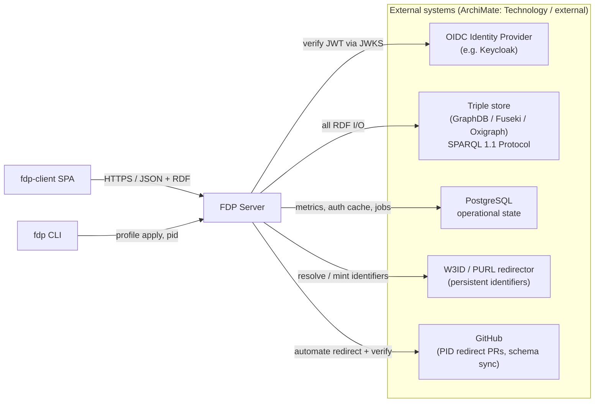
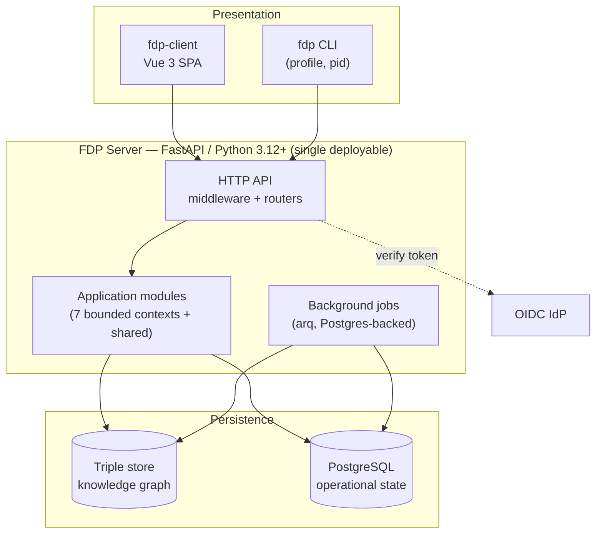

# 1. System Context

This document zooms from the outside in: who uses the FDP, what external systems it depends on, and the major runtime containers. It is the "where am I" map before you open any source file.

← [Back to index](README.md) · Next → [Application architecture](02-application-architecture.md)

---

## 1.1 Actors — who participates

The FDP defines roles *functionally*. A single human can occupy several at once; the system maps an external identity provider's claims onto these roles through ODRL constraints, not through a built-in user table.

| Actor | Goal | How they interact |
|---|---|---|
| **Anonymous consumer** | Find and read public metadata; run public SPARQL queries | LDP GETs and the SPARQL endpoint, no token |
| **Authenticated user** | Read restricted metadata they are entitled to | Same surfaces, with an OIDC bearer token or API key |
| **Steward / curator** | Create, edit, version metadata records; manage offers | LDP writes (POST/PUT/PATCH/DELETE), policy admin |
| **Administrator** | Manage schemas, resource definitions, profiles, settings, users | The `/fdp-api` admin routers; `admin` role required |
| **Operator / SRE** | Deploy, configure, back up, observe | Config, health/readiness probes, the CLI, the metrics dashboard |
| **Client SPA (`fdp-client`)** | Render the above for humans | A separate repository; talks only to this server's HTTP API |

## 1.2 External systems

Key constraints baked into these dependencies:

- **The triple store is reached only through one SPARQL 1.1 Protocol adapter.** No vendor-specific APIs on the request path; vendor capabilities sit behind capability flags. See [ADR-0005](../adr/0005-triple-store-pluggability.md).
- **The FDP keeps no user database.** Authentication is delegated entirely to the OIDC provider; the server verifies tokens against the IdP's JWKS. See [doc 5 §1](05-key-processes.md#1-authentication-identity-context).
- **Persistent identity is decoupled from the serving host.** A record's IRI prefix (`identifier_base`, a W3ID/PURL redirector) is separate from the `base_url` the server is reached at. See [ADR-0014](../adr/0014-persistent-identifiers.md).

## 1.3 Container view (ArchiMate technology layer)

The whole server is **one process** (a modular monolith). The boundaries that matter are *inside* it — that's [doc 2](02-application-architecture.md). The background-job runner (arq) shares the codebase and Postgres; there is no Redis.

## 1.4 What the server is responsible for (and what it is not)

**In scope (v1):**

- FDP-spec-conformant metadata structure, vocabulary, and content negotiation
- Full W3C LDP (containment, negotiation, PATCH)
- User-defined SHACL schemas, composable into type hierarchies
- ODRL access control on records and schemas
- An access-controlled SPARQL endpoint exposed by the FDP (not the raw triple store)
- Anonymous usage metrics + dashboard
- Simple anonymous-read data distribution
- Versioned deployment profiles
- Persistent identifiers (FAIR F1)

**Out of scope (v1), so you don't go looking for it:**

- FDP-to-FDP federation (a future FDP Index service)
- Internal user management / role storage (delegated to the IdP)
- Access-controlled data delivery (only anonymous-read distributions today)
- Property-level (sub-record) access control — the unit of authorization is the named graph
- ODRL Duty/obligation enforcement (Permissions + Prohibitions only)

The full goals/non-goals list is architecture doc §2.

---

← [Back to index](README.md) · Next → [Application architecture](02-application-architecture.md)
