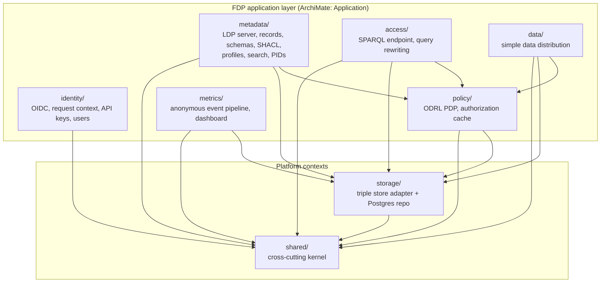
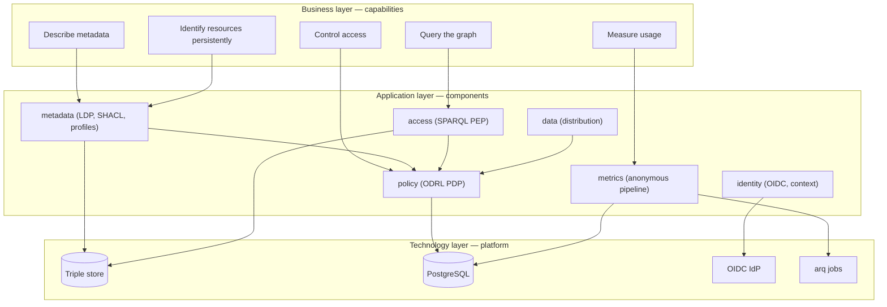
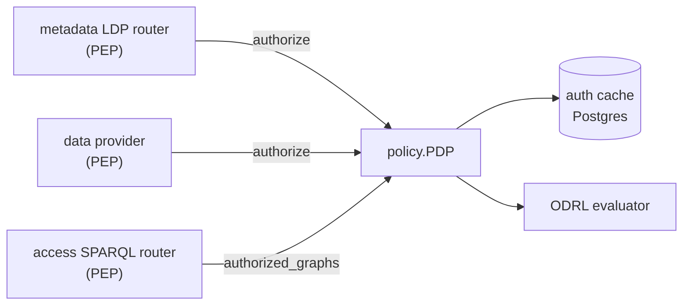
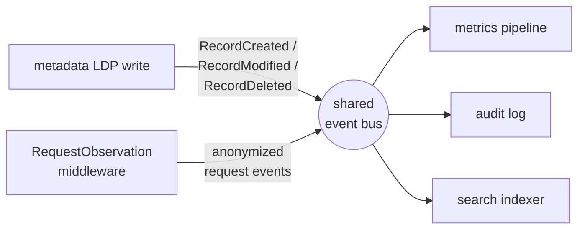

# 2. Application Architecture

This is the most important document in the package. It explains the modular-monolith structure, the seven bounded contexts, the rules that keep them separate, and how they communicate. Internalize this before you change any module — most review comments on new contributors' PRs are boundary violations this document would have prevented.

← [System context](01-system-context.md) · Next → [Code organization](03-code-organization.md)

---

## 2.1 The shape: a modular monolith

The server deploys as one process but is partitioned into **bounded contexts** with enforced boundaries. The payoff: you can reason about, test, and change one context without loading the whole system into your head, and the boundaries are cheap to police in review. See [ADR-0001](../adr/0001-modular-monolith.md).

## 2.2 The contexts and their allowed imports

This is the rule table. An arrow that isn't listed here is a violation.

| Module | Owns | May import |
|---|---|---|
| `identity/` | OIDC token verification, `RequestContext`, API keys, user-management facade | `shared` |
| `metadata/` | LDP server, records, SHACL schemas, profiles, resource definitions, search, PIDs | `shared`, `storage`, `policy` (via the authorize interface) |
| `policy/` | ODRL evaluator, PDP, authorization cache | `shared`, `storage` |
| `access/` | SPARQL endpoint, query parsing + rewriting | `shared`, `policy`, `storage` |
| `data/` | Simple data provider (distributions) | `shared`, `policy`, `storage` |
| `metrics/` | Anonymous event pipeline, dashboard API | `shared`, `storage` |
| `storage/` | Triple store adapter (SPARQL 1.1), Postgres models/engine | `shared` |
| `shared/` | RDF utils, namespaces, event bus, request context, errors, logging | **nothing** |

Three rules follow from the table:

1. **`shared` imports nothing internal.** It is the kernel. If you want to add to it, first ask whether the thing genuinely crosses contexts (RDF helpers, namespaces, the event bus, error types, structured logging) or whether it belongs *inside* one context. Default to inside.
2. **Cross-module calls are explicit interfaces, not internals.** The canonical example: every Policy Enforcement Point calls `policy.authorize(subject, action, resource)` — see §2.4. Nobody evaluates ODRL outside `policy`.
3. **All RDF I/O goes through `storage`'s triple store adapter.** No direct vendor HTTP, no SPARQL outside the adapter port.

> Note on `metadata/` size: it is by far the largest context (it has absorbed search, PIDs, and profiles). [ADR-0009](../adr/0009-runtime-resource-definitions.md) and the [next-steps suggestions](../nextstepssuggestions.md) flag splitting `search/` and `profiles/` into their own contexts as planned work. If you are adding a genuinely new concern, prefer a new sub-package with a clean event-bus seam over piling into `metadata/`.

## 2.3 ArchiMate-style layered view

A three-layer cut (business / application / technology), the way an architect would present it to a stakeholder.

## 2.4 The one interface that matters: `policy.authorize`

Every place that protects a resource is a **Policy Enforcement Point (PEP)** and calls the same **Policy Decision Point (PDP)**. There is exactly one decision function and one bulk-lookup function:

- `authorize(ctx, action, resource_iri) -> Decision` — single resource. Used by the LDP layer ([metadata/ldp/router.py](../../src/fdpneo_server/metadata/ldp/router.py)) and the data provider.
- `authorized_graphs(ctx, action) -> set[URIRef]` — bulk. Used by the SPARQL endpoint to build the dataset a query may see ([access/router.py](../../src/fdpneo_server/access/router.py)).

The PDP is cache-backed (the materialized authorization index in Postgres). Writes that change entitlements invalidate the cache — see [doc 5 §2](05-key-processes.md#2-authorization-pdppep). The ODRL profile (Permissions + Prohibitions, conflict resolution) is in [ADR-0006](../adr/0006-odrl-profile-permission-prohibition.md).

## 2.5 Asynchronous communication: the in-process event bus

Contexts that must react to each other without coupling do so through the **event bus** in `shared`. A writer publishes an event; subscribers handle it asynchronously, in-process. This is how a record write fans out to metrics, audit, and search without the LDP layer knowing those exist.

Subscribers are bound at startup in the FastAPI `lifespan` ([main.py](../../src/fdpneo_server/main.py) `lifespan`): `metrics_pipeline.start(bus)`, `audit_log.start(bus)`, `search_indexer.start(bus)`. Event types live next to their producers, e.g. [metadata/events.py](../../src/fdpneo_server/metadata/events.py).

**Why an event bus and not direct calls?** A record write should not import metrics, audit, or search — that would invert the dependency rules and make the write path care about concerns it shouldn't. Publishing an event keeps the write path ignorant of who listens. It also means the **metrics anonymization boundary** is structural: the request observer snapshots an *already-anonymized* context, so identifying data never reaches a subscriber. See [ADR-0002](../adr/0002-anonymous-metrics.md).

## 2.6 Composition root

Everything is wired in one place: `create_app()` in [main.py](../../src/fdpneo_server/main.py). It builds the shared singletons (`_build_shared_state`), constructs each router with its collaborators, registers middleware and routers in a deliberate order, and installs the `lifespan` handler that binds event subscribers and runs bootstrap. There is no global app instance — `create_app()` is a function so tests can build isolated apps. The exact order is [doc 4](04-request-lifecycle.md).

---

← [System context](01-system-context.md) · Next → [Code organization](03-code-organization.md)
