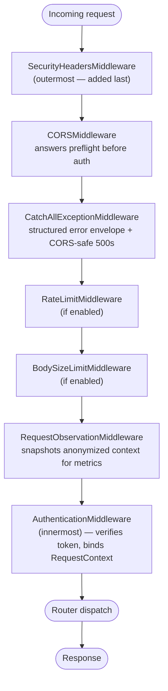
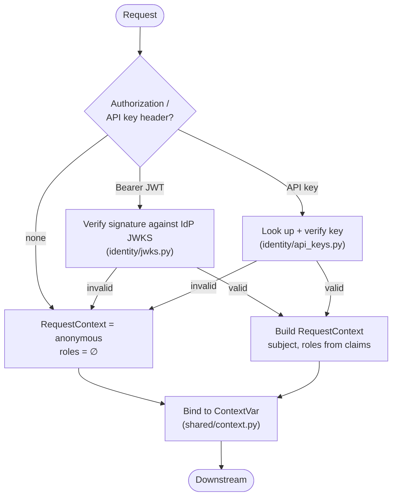
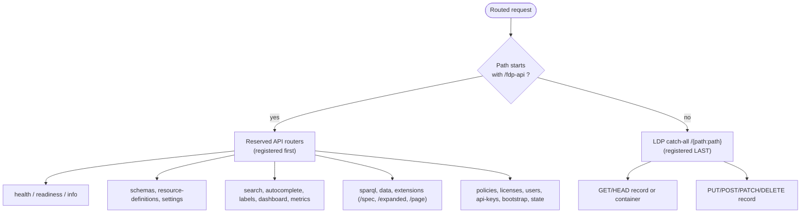
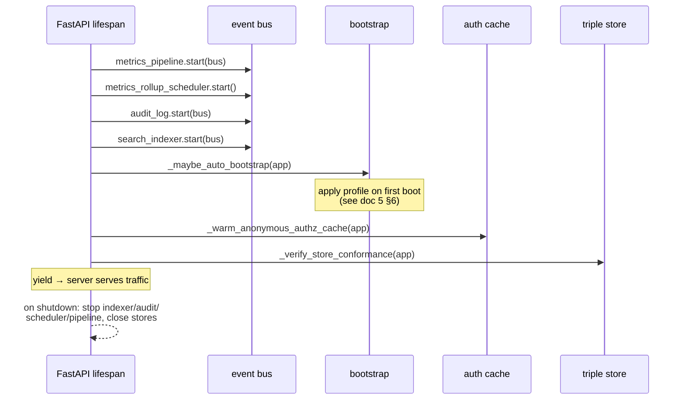

# 4. Request Lifecycle

Every HTTP request flows through the same middleware pipeline before it reaches a router. Understanding this stack is what lets you debug "why did my request 403 / 429 / get no CORS headers / not get observed by metrics." This document is the map of that pipeline and the routing that follows it.

← [Code organization](03-code-organization.md) · Next → [Key processes](05-key-processes.md)

---

## 4.1 The middleware stack

Middleware is registered in [main.py](../../src/fdpneo_server/main.py) `create_app()`. The ordering rule is a known FastAPI/Starlette gotcha: **`add_middleware` inserts at the head of the stack, so the *last* call is the *outermost* layer.** The code adds them in a deliberate order to get this outer→inner arrangement:

Why this order (each is a deliberate decision, not an accident):

- **Security headers outermost** so the headers land on *every* response, including CORS preflights and errors thrown by inner layers.
- **CORS next** so it can answer the browser's preflight `OPTIONS` directly, *before* auth, and attach `Access-Control-*` headers even to error responses. Without this the SPA (a different origin) is blocked on every write.
- **Catch-all error envelope just inside CORS** so an unexpected exception returns the structured envelope *with* CORS headers instead of a bare 500. `FDPError`s keep their status; everything else becomes a generic 500 with the stack logged server-side only.
- **Rate + body-size limits** sit just inside CORS and outside auth, so floods and oversize bodies are shed before the server does JWKS/auth work. These are per-instance defense-in-depth; the reverse proxy is the authoritative limiter.
- **Request observer inside auth** — this is subtle and load-bearing. The observer snapshots the `RequestContext` for metrics. It is placed *inside* `AuthenticationMiddleware` so the context var is already bound, and critically so the context it snapshots is the **anonymized** one. This is the structural metrics privacy boundary. See [ADR-0002](../adr/0002-anonymous-metrics.md).
- **Authentication innermost** — verifies the OIDC bearer token (against the IdP JWKS) or API key, builds the `RequestContext` (subject, roles), and binds it to a `ContextVar` that the rest of the request reads.

## 4.2 Authentication detail

`AuthenticationMiddleware` ([identity/middleware.py](../../src/fdpneo_server/identity/middleware.py)) accepts two credential types and always produces a `RequestContext` — anonymous if no valid credential is present (anonymous is a first-class principal, not an error):

Authorization is **not** done here — authentication only establishes *who you are*. *What you may do* is decided later by the PDP at each PEP. This authentication/authorization split is deliberate (architecture §7.4): the IdP owns identity; the FDP owns entitlement via ODRL.

## 4.3 Routing: `/fdp-api` vs the LDP record space

After middleware, the request hits routing. Routers are registered in a specific order in `create_app()`, and **order matters** because the LDP router ends in a catch-all.

The consequence, restated because it trips up everyone once:

- `GET /catalog/dc-check` → the **LDP record** at that IRI (catch-all).
- `GET /fdp-api/catalog/spec` → the **SHACL shape** (composed closure) for the `catalog` type (extensions router).
- `POST /fdp-api/sparql` → the access-controlled SPARQL endpoint.

The reserved prefix is `RESERVED_API_PATH` in [shared/reserved.py](../../src/fdpneo_server/shared/reserved.py) (value `/fdp-api`). OpenAPI/docs are themselves mounted under it: `/fdp-api/openapi.json`, `/fdp-api/docs`. The LDP router is registered last precisely so its `/{path:path}` doesn't shadow the API routes.

### 4.3.1 Write-path invariants (v0.4.0, ADR-0016 §1)

A record write (`PUT`/`POST`) must resolve to an unambiguous canonical subject, and `POST` never overwrites:

- **Canonical subject required → `400 fdp.ambiguous_subject`.** When a persistent-identifier base is configured, `reconcile_identifiers` requires the body to address the record as `<>` / its canonical IRI, or to carry exactly one typed IRI subject (rebound to the canonical IRI; a foreign one is recorded as a cross-reference). Zero typed subjects, several, or a blank-node-only body is rejected — there is no "store as authored" escape hatch, so a graph is never keyed under an IRI it does not mention.
- **`POST` `Slug` collision → `409 fdp.conflict`.** Before writing a new member, the LDP router checks whether the slug-derived IRI already exists (record graph non-empty, or its meta graph carries `dct:created`). If so it refuses, so migration scripts get a predictable error instead of silent data loss; use `PUT` + `If-Match` to replace deliberately.

### 4.3.2 Publication state for reserved-namespace resources

Server-managed resources — policies, licenses, schemas, resource definitions — have canonical IRIs under `<base>/fdp-api/<segment>/<id>`, but the publication-state router is itself mounted under `/fdp-api`. `state_record_iri` ([shared/graphs.py](../../src/fdpneo_server/shared/graphs.py)) re-adds the reserved prefix when the state path's leading segment is a managed one, and passes root-level LDP records (`/catalog/x`) straight through — so `POST /fdp-api/policies/{id}/state` targets the graph the policy is actually stored under rather than a non-existent root IRI.

### 4.3.3 Signposting on read (v0.4.0, ADR-0017 §2)

On a successful `GET`/`HEAD` of an existing record, the handlers append **FAIR Signposting** (Level 1) relations to the response `Link` header — the same header carrying the LDP `rel="type"` and `ldp:constrainedBy` links, which stay first. The relations ([metadata/signposting.py](../../src/fdpneo_server/metadata/signposting.py)) are built from the graph already in hand (no extra store round-trip) and *before* any `Prefer` minimisation, so they reflect the full record:

- `cite-as` — the IRI a consumer should cite: a client-asserted `owl:sameAs` under a recognised PID resolver, else an `adms:identifier`/`dct:identifier` PID, else the **canonical** IRI (used even when the request arrived on a serving origin).
- `describedby` (canonical IRI, once per supported RDF media type, with `type`), `type` (`rdf:type`), `license`, `author` (`dct:creator`/`dct:publisher`), `item` (`ldp:contains` + typed member relations), `collection` (`dct:isPartOf`).

The total is capped (`signposting.MAX_LINKS`) so a large container cannot bloat the header; surplus `item` links are trimmed first (Level-2 `linkset` is deferred). `HEAD` carries the same `Link` header as `GET`.

### 4.3.3a In-band affordances on read (v0.11.0, ADR-0022)

Alongside the signposting relations, `GET`/`HEAD` appends the record's **management affordances** so a client reaches them by link-following, not URL-template convention or OpenAPI ([metadata/signposting.py](../../src/fdpneo_server/metadata/signposting.py) `affordance_links`, wired through the router's `_navigation_links`). All use extension relation IRIs under `https://w3id.org/fdp/fdp-o#` (provisional; opaque to conforming clients, so a later IRI swap is compatible):

- `hasMetaMetadata` → `<record>/meta`; `hasSpec` → `<record>/spec` (instance) and `<base>/<urlPrefix>/spec` (type-level, what create forms need); `hasExpandedView` → `<record>/expanded`; `hasStateTransition` → `<record>/state`; `hasMemberPage` → `<record>/page/{childPrefix}` per child type (containers).
- The **root** FDP record additionally advertises the API description: `service-desc` (`/fdp-api/openapi.json`), `service-doc` (`/fdp-api/docs`, only when docs UIs are enabled), and `hasResourceDefinitions` (`/fdp-api/resource-definitions`). Root is detected via the RD cache (`url_prefix == ""`), and the links are relative-path references so they resolve on whichever serving host answered.

Affordance links are advertised **unconditionally** — the link names the affordance; the PDP still authorizes each request. They are *fixed* relations for the `MAX_LINKS` cap (the signposting `item` budget is shrunk by their count via the `reserved` param, so affordances always survive and only surplus `item` links are trimmed). A `/meta`, `/audit` or `/data` **sibling** GET does *not* re-advertise them (only the record does). The served `<record>/meta` representation also gains read-time `fdp-o:allowedStateTransition` **view triples** (the record's next states, from the lifecycle machine) — never stored, dumped, or SHACL-validated. Paginated `/page` responses carry RFC 8288 `rel="first"/"prev"/"next"/"last"` navigation (the legacy `X-FDP-Page-*` headers are deprecated, removal v0.12.0).

### 4.3.4 Self-describing conformance binding (v0.5.0, ADR-0019)

A record write (`PUT`/`POST`/`PATCH`) makes the stored record **self-describing at rest**. After SHACL validation and *before* the record graph is persisted, the LDP router ([ldp/router.py](../../src/fdpneo_server/metadata/ldp/router.py) `_stamp_conformance`) does two things:

- **Stamps `dct:conformsTo` → the type's stable profile** into the record graph. The binding is server-owned: any client-supplied `dct:conformsTo` pointing into the managed profile namespace (`<base>/fdp-api/profiles/…`) is dropped first (enforcing "a record's profile equals its type default", ADR-0019 §2); a `conformsTo` to any *other* vocabulary/profile is left untouched. The stable profile IRI always resolves to the current version, so the public binding never goes stale.
- **Records `fdp-o:validatedAgainst` → the exact profile *version*** in the sibling `<record>/meta` graph (threaded through `repo.put_graph(..., validated_against=…)` into the meta writer). This is the provenance that lets a restore/import reproduce the original validation; a write that doesn't re-validate preserves whatever the last content write recorded.

The profile (a `prof:Profile` with a `role:validation` resource pointing at an immutable schema-version snapshot) is the **1:1 wrapper of the type's schema**, auto-provisioned on schema publish and, as a safety net, **lazily provisioned on first write** of a bootstrap-seeded type ([metadata/prof.py](../../src/fdpneo_server/metadata/prof.py) `ensure_conformance`). Validation still resolves the shape through the resource definition's `ldp:constrainedBy` (the stable schema == the pinned version's shape at write time, so the result is identical); ADR-0019 §2 records why `constrainedBy` stays on the schema rather than flipping to the profile.

## 4.4 Startup and shutdown (lifespan)

The FastAPI `lifespan` handler ([main.py](../../src/fdpneo_server/main.py) `lifespan`) runs once at boot and once at teardown. Startup binds the event-bus subscribers and runs first-boot setup:

`_verify_store_conformance` probes the configured triple store at startup (it can flip readiness) so the deployment fails fast against a misconfigured or incompatible store rather than at first query.

---

← [Code organization](03-code-organization.md) · Next → [Key processes](05-key-processes.md)
