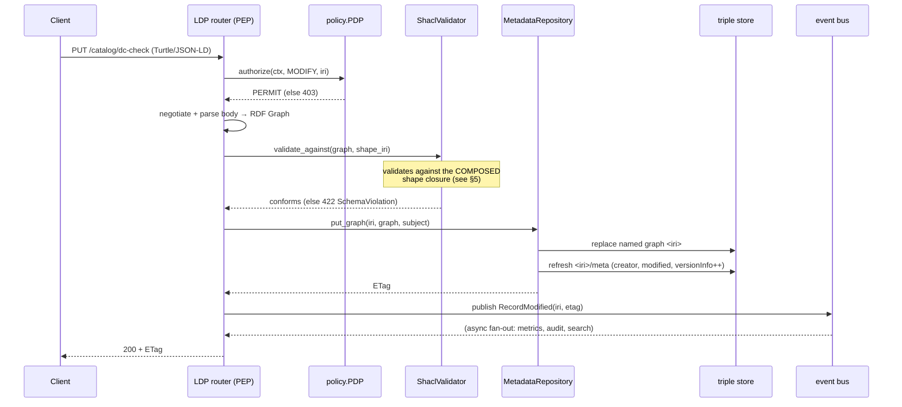
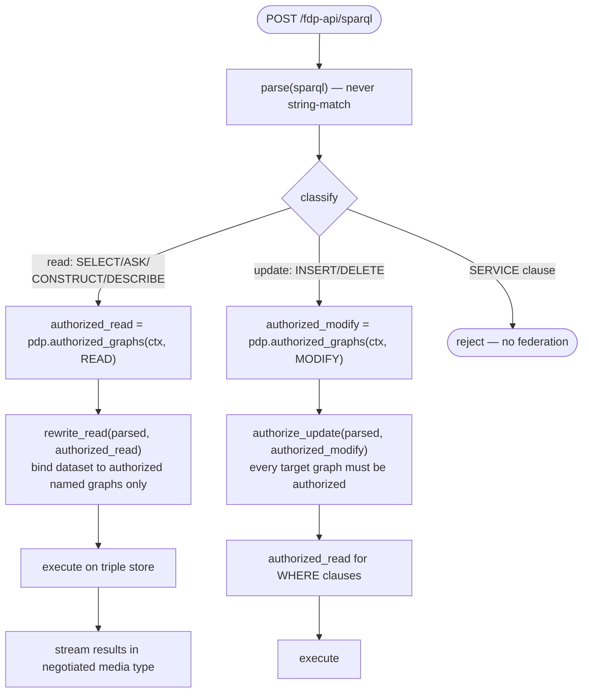
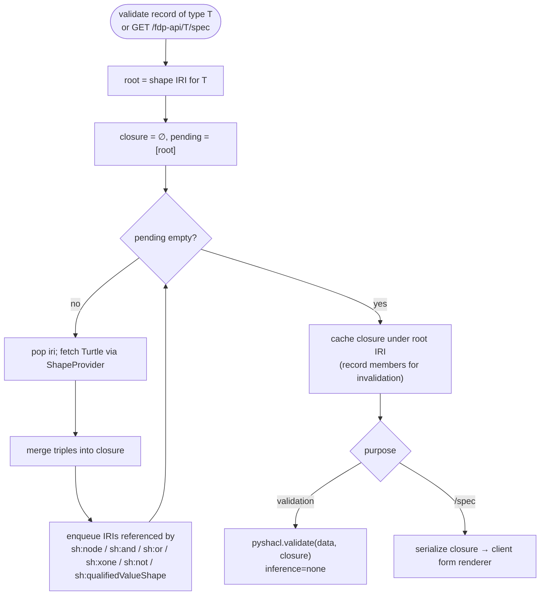
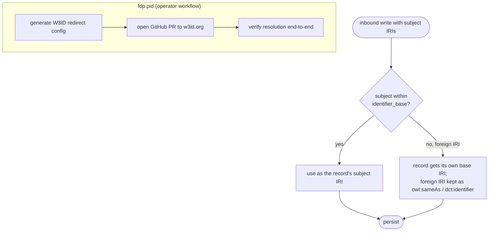
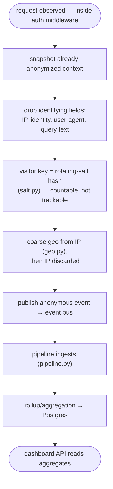

# 5. Key Processes

This is the heart of the package. Each section is one core process, with the participants named and a UML sequence and/or activity diagram. If you understand these seven, you understand how the FDP works.

← [Request lifecycle](04-request-lifecycle.md) · Next → [Data model](06-data-model.md)

Processes:
1. [Authentication / identity context](#1-authentication-identity-context)
2. [Authorization (PDP/PEP)](#2-authorization-pdppep)
3. [Record CRUD via LDP (a write)](#3-record-crud-via-ldp-a-write)
4. [SPARQL access control](#4-sparql-access-control)
5. [Schema composition and validation](#5-schema-composition-and-validation)
6. [Profile bootstrap](#6-profile-bootstrap)
7. [Persistent identifiers](#7-persistent-identifiers)
8. [Metrics anonymization](#8-metrics-anonymization)

---

## 1. Authentication / identity context

**Who participates:** the client, `AuthenticationMiddleware` ([identity/middleware.py](../../src/fdp/identity/middleware.py)), the JWKS client ([identity/jwks.py](../../src/fdp/identity/jwks.py)) or API-key service, the external OIDC IdP, and `RequestContext` ([shared/context.py](../../src/fdp/shared/context.py)).

Covered as a flow in [doc 4 §4.2](04-request-lifecycle.md#42-authentication-detail). The one thing to re-state: authentication produces a `RequestContext` for *every* request, anonymous included, and binds it to a `ContextVar`. It never decides access. That is the next process.

---

## 2. Authorization (PDP/PEP)

**Who participates:** a **PEP** (the LDP router, the data provider, or the SPARQL router), the **PDP** ([policy/pdp.py](../../src/fdp/policy/pdp.py)), the authorization cache ([policy/cache.py](../../src/fdp/policy/cache.py), Postgres), the ODRL evaluator ([policy/evaluator.py](../../src/fdp/policy/evaluator.py)), and the offer resolver.

The PDP has two entry points:

- `authorize(ctx, action, resource) -> Decision` — one resource. PERMIT/DENY + rule + reason.
- `authorized_graphs(ctx, action) -> set[URIRef]` — the set of graphs the subject may act on. The bulk form the SPARQL endpoint needs.

```mermaid
sequenceDiagram
    participant PEP as PEP (e.g. LDP router)
    participant PDP as policy.PDP
    participant Cache as auth cache (Postgres)
    participant Eval as ODRL evaluator
    participant Off as offer resolver

    PEP->>PDP: authorize(ctx, action, resource)
    PDP->>Cache: lookup(subject_key, action, resource)
    alt cache hit
        Cache-->>PDP: cached decision
        PDP-->>PEP: Decision(outcome, reason="cached")
    else cache miss
        PDP->>Off: resolve_offer(resource)
        Off-->>PDP: Offer (ODRL) or none
        alt no offer
            PDP-->>PEP: Decision(DENY)
        else offer found
            PDP->>Eval: evaluate(ctx, action, offer)
            Eval-->>PDP: PERMIT / DENY (+ rule)
            PDP->>Cache: store(decision)
            PDP-->>PEP: Decision
        end
    end
    Note over PEP: DENY → raise Forbidden (403)
```

**ODRL model (the gist):** access is granted by **Offers** containing Permissions and Prohibitions. Prohibitions win conflicts. There are no Duties in v1. The full profile and conflict-resolution rules are [ADR-0006](../adr/0006-odrl-profile-permission-prohibition.md) and architecture §8. On grant, an **Agreement** is materialized into the record's `…/audit` graph for provenance.

**Cache invalidation — the correctness-critical part.** The cache is a materialized projection; it must be invalidated when entitlements change. The PDP exposes:
`invalidate_resource(iri)`, `invalidate_subject(ctx)`, `invalidate_subject_key(key)`, `invalidate_all()`. A record or policy write triggers the appropriate invalidation. If you add a path that changes who-can-do-what, you **must** invalidate, or stale PERMIT/DENY decisions leak. This is the single highest-risk surface in the codebase.

---

## 3. Record CRUD via LDP (a write)

**Who participates:** the LDP router ([metadata/ldp/router.py](../../src/fdp/metadata/ldp/router.py)), content negotiation, the PDP (as PEP), the SHACL validator ([metadata/shacl.py](../../src/fdp/metadata/shacl.py)), the metadata repository ([metadata/repository.py](../../src/fdp/metadata/repository.py)), meta-metadata ([metadata/meta.py](../../src/fdp/metadata/meta.py)), the event bus, and the triple store adapter.

A `PUT` is the representative case. The order is **authorize → negotiate/parse → validate → persist → meta-refresh → publish**:



The same skeleton applies to the other methods:

```mermaid
flowchart TB
    START([HTTP method on /{path}]) --> AUTH{authorize<br/>action?}
    AUTH -->|DENY| F403([403 Forbidden])
    AUTH -->|PERMIT| M{method}
    M -->|GET/HEAD| READ["read graph → negotiate → ETag → return"]
    M -->|PUT| PUTV["validate vs resource shape → put_graph → meta refresh"]
    M -->|POST| POSTV["mint child IRI → validate vs container's member shape → put_graph → membership"]
    M -->|PATCH| PATCHV["simulate SPARQL-Update (patch.py) → validate result → put_graph"]
    M -->|DELETE| DEL["delete_graph + meta/audit + membership"]
    PUTV --> EVT
    POSTV --> EVT
    PATCHV --> EVT
    DEL --> EVT
    EVT["publish Record* event"] --> DONE([response + ETag])
    READ --> DONE
```

Things to know before you touch this path:

- **Don't bypass the LDP layer for record CRUD.** Even internal helpers go through `put_graph`/`delete_graph` so SHACL validation, meta-metadata, membership, and events all stay consistent.
- **PATCH is SPARQL-Update**, simulated first ([metadata/patch.py](../../src/fdp/metadata/patch.py)) so the *result* is validated before it's committed — you never persist an invalid intermediate.
- **POST into a container** validates the new member against the *container's* declared member shape; **PUT** validates against the *resource's own* shape.
- **Concurrency** is ETag-based (`If-Match`). ETags are computed from the graph ([metadata/etag.py](../../src/fdp/metadata/etag.py)).
- **Identifier reconciliation** ([metadata/identifiers.py](../../src/fdp/metadata/identifiers.py)) canonicalizes inbound IRIs and handles client-supplied identifiers — see §7.

---

## 4. SPARQL access control

**Who participates:** the SPARQL router ([access/router.py](../../src/fdp/access/router.py)), the parser ([access/parser.py](../../src/fdp/access/parser.py)), the rewriter ([access/rewriter.py](../../src/fdp/access/rewriter.py)), the PDP (`authorized_graphs`), and the triple store adapter.

The FDP exposes its **own** SPARQL endpoint rather than proxying the triple store, because that is the only way to enforce access control on queries. The enforcement mechanism is **named-graph projection** ([ADR-0004](../adr/0004-sparql-access-via-named-graph-projection.md)): a query is only ever run against the dataset of named graphs the caller is authorized to read. For reads, **the rewriter itself is the PEP** — there is no single resource to check, so the dataset is constrained instead.



```mermaid
sequenceDiagram
    participant C as Client
    participant SR as SPARQL router (PEP)
    participant Par as parser
    participant PDP as policy.PDP
    participant Rw as rewriter
    participant TS as triple store

    C->>SR: POST /fdp-api/sparql (query)
    SR->>Par: parse(sparql)
    Par-->>SR: ParsedRead | ParsedUpdate (+ form)
    alt read
        SR->>PDP: authorized_graphs(ctx, READ)
        PDP-->>SR: {graph IRIs}
        SR->>Rw: rewrite_read(parsed, authorized_read)
        Rw-->>SR: dataset-scoped query
        SR->>TS: execute
        TS-->>SR: results
        SR-->>C: stream (SELECT JSON / RDF)
    else update
        SR->>PDP: authorized_graphs(ctx, MODIFY)
        SR->>Rw: authorize_update(parsed, authorized_modify)
        Rw-->>SR: ok (else 403)
        SR->>TS: execute
        SR-->>C: 204
    end
```

Non-obvious rules, all of which have a security reason:

- **Queries are parsed, never pattern-matched.** Classification and rewriting work on the parsed algebra. Never f-string anything into a SPARQL string.
- **`SERVICE` clauses are rejected.** They would let a query exfiltrate to (or pull from) an arbitrary endpoint, bypassing access control. No federation in v1.
- **Internal graphs are excluded from the dataset** — `…/meta`, `…/audit`, and the reserved resource-definition namespace never appear in public results. There is one shared exclusion set (see [doc 6](06-data-model.md) and [ADR-0009](../adr/0009-runtime-resource-definitions.md)) used by both the rewriter and the PDP, so there is exactly one definition of "internal."
- **Updates must name their target graphs** (v1 restriction) so `authorize_update` can check each target against `authorized_modify`.

---

## 5. Schema composition and validation

**Who participates:** the SHACL validator ([metadata/shacl.py](../../src/fdp/metadata/shacl.py)), the shape provider ([metadata/shape_provider.py](../../src/fdp/metadata/shape_provider.py)), the schema admin API ([metadata/schemas.py](../../src/fdp/metadata/schemas.py)), and the `/spec` extension ([metadata/extensions.py](../../src/fdp/metadata/extensions.py)).

The FDP supports **schema composition**: a type's shape can compose other shapes via `sh:node` (and `sh:and`/`sh:or`/`sh:xone`). This is how the bundled DCAT profile models the class hierarchy `dcat:Catalog ⊑ dcat:Dataset ⊑ dcat:Resource` — each level pulls its parent in with `sh:node`, and `resource` is a base mixin with no `sh:targetClass`.

The validator assembles the **transitive closure** — the requested shape plus every shape it composes, merged into one graph that pySHACL validates against:



Two things every contributor here must know:

- **Composition is structural, not RDFS inference.** Validation follows the explicit `sh:node` chain, with `inference="none"`. It does **not** rely on `rdfs:subClassOf`. A shape referenced via `sh:node` contributes only its *constraints* — its own `sh:targetClass` is ignored in that context. So it's fine that `dataset`'s shape carries `sh:targetClass dcat:Dataset`; when `catalog` pulls it in, the target class plays no role.
- **The closure cache cascades on invalidation.** Editing a base shape (`resource`) drops every composed closure that imports it, so the next validation rebuilds with the new base. The validator tracks closure membership for exactly this.

Editing a shape at runtime (`PUT /fdp-api/schemas/{id}`) bumps its `owl:versionInfo`, invalidates and re-warms the validator cache, and keeps a stable IRI so resource-definition references stay valid. The `/spec` endpoint serves the *composed* closure precisely so the client's form renderer sees inherited properties in one response. (Composition validation is conjunctive: every property shape on a path, from every level, applies — there is no override, only tightening.)

---

## 6. Profile bootstrap

**Who participates:** the CLI ([cli.py](../../src/fdp/cli.py)) or the auto-bootstrap hook in `lifespan`, the profile applier ([metadata/profiles/applier.py](../../src/fdp/metadata/profiles/applier.py)), the profile manifest/registry, the metadata repository, and the triple store.

A **deployment profile** ([profiles/default/](../../profiles/default/)) is a versioned bundle: SHACL schemas, ODRL offers, the container hierarchy, resource definitions, and seed records. Applying it is how a fresh FDP becomes a working DCAT repository.

```mermaid
flowchart TB
    A([fdp profile apply ./profiles/default<br/>or first-boot auto-bootstrap]) --> B["parse + validate manifest (profile.yaml)"]
    B --> C["load SHACL shapes (schemas/*.ttl)"]
    C --> D["expand urn:fdp-schema: placeholders → storage IRIs"]
    D --> E["write each shape as a record<br/>under /fdp-api/schemas/{id}"]
    E --> F["seed resource definitions (ADR-0009)<br/>→ reserved RD namespace"]
    F --> G["write offers + root container + seed records"]
    G --> H["warm SHACL validator + authz cache"]
    H --> I([API surface lights up:<br/>/{prefix}, /spec, /page per type])
```

Key facts:

- **Resource definitions are runtime RDF records, seeded from the profile** — not immutable bootstrap-only config. Admins add/re-parent types at runtime through `rd_api.py` and the LDP + OpenAPI surfaces update without a restart. The manifest is the *seed*, not the permanent definition. See [ADR-0009](../adr/0009-runtime-resource-definitions.md).
- **Changing the bootstrap *profile* still requires re-bootstrap** (architecture §12.3); changing types at runtime does not.
- **Auto-bootstrap** runs in `lifespan` on first boot ([main.py](../../src/fdp/main.py) `_maybe_auto_bootstrap`) so a fresh deployment is usable without a manual CLI step.

---

## 7. Persistent identifiers

**Who participates:** identifier reconciliation ([metadata/identifiers.py](../../src/fdp/metadata/identifiers.py)), the PID package ([metadata/pid/](../../src/fdp/metadata/pid/): `w3id.py`, `github.py`, `verify.py`, `rebase.py`), config (`identifier_base` vs `base_url`), and the `fdp pid` CLI.

Persistent identifiers (FAIR F1) decouple a record's **identity** (`identifier_base`, a W3ID/PURL redirector prefix) from the **serving host** (`base_url`). Inbound requests are canonicalized so a record is the same subject regardless of which host served it. See [ADR-0014](../adr/0014-persistent-identifiers.md).



The dual model means clients can supply their own identifiers: within-base identifiers become the subject; foreign ones are attached as equivalences rather than silently rewritten. Deferred (open questions): Handle/DOI minting integrations and identifier-based backup/restore.

---

## 8. Metrics anonymization

**Who participates:** `RequestObservationMiddleware` ([metrics/middleware.py](../../src/fdp/metrics/middleware.py)), the anonymizer ([metrics/anonymize.py](../../src/fdp/metrics/anonymize.py)), the salt store ([metrics/salt.py](../../src/fdp/metrics/salt.py)), the geo resolver ([metrics/geo.py](../../src/fdp/metrics/geo.py)), the pipeline ([metrics/pipeline.py](../../src/fdp/metrics/pipeline.py)), aggregation/rollup, and the dashboard API.

The invariant: **the metrics pipeline never sees identifying data.** Anonymization happens at **ingress**, structurally, before any event reaches a metrics handler — not at report time. See [ADR-0002](../adr/0002-anonymous-metrics.md).



Why each step exists:

- **Anonymize at ingress, not at report time** — so identifying data is never persisted in the first place; you can't leak what you never stored.
- **Rotating-salt hashing** lets you *count* unique visitors over a window without a stable identifier that could track them. The salt rotates, so cross-window correlation is structurally impossible.
- **Query text is never stored** — it can carry identifying or sensitive content.
- **No analytics cookies.** Visitor counting uses the rotating hash, not a client-stored ID.
- **Hard rule for contributors:** never add a `user_id` (or any identifying) column to a metrics table. The boundary is structural, not a policy you can opt out of. If you think you need identity in metrics, you've found a design conversation, not a code change.

---

← [Request lifecycle](04-request-lifecycle.md) · Next → [Data model](06-data-model.md)
