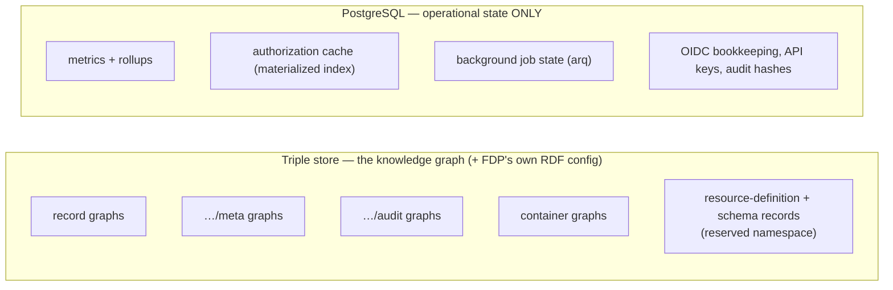
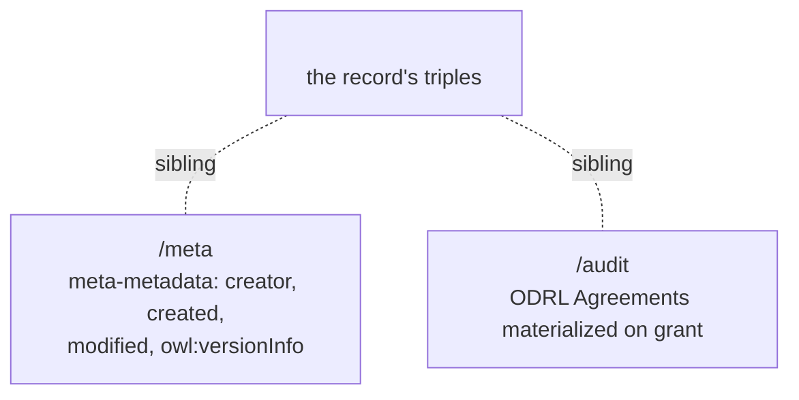
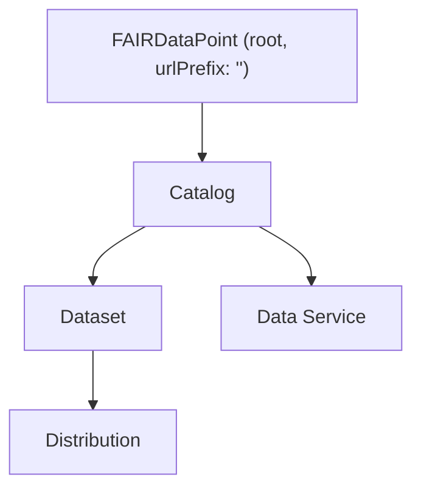

# 6. Data Model

The FDP keeps state in two stores with a strict division of labour. Getting this division right is what keeps the knowledge graph clean and the system operable. This document explains what lives where, and the named-graph layout inside the triple store.

← [Key processes](05-key-processes.md) · Next → [Contributing](07-contributing.md)

---

## 6.1 Two stores, one rule

The dividing question, applied to anything you're about to persist:

> **Is it metadata describing the repository's content or structure?** → triple store (as RDF).
> **Is it runtime bookkeeping?** → Postgres.

So records, meta-metadata, ODRL offers, SHACL shapes, and resource definitions are all RDF in the triple store ([ADR-0009](../adr/0009-runtime-resource-definitions.md) clarified that the FDP's own *configuration* records belong there too). Metrics, the auth cache, job state, and OIDC/API-key bookkeeping are operational and live in Postgres ([ADR-0003](../adr/0003-fixed-postgres-for-operational-state.md)).

**Never write operational state into a named graph, and never put a knowledge-graph fact into Postgres.** This is the load-bearing data-model rule.

## 6.2 One named graph per record

The central invariant ([ADR-0007](../adr/0007-one-graph-per-record.md)): **every metadata record's triples live in exactly one named graph**, whose URI is the record's IRI. Two sibling graphs hang off it:

- **Record graph** — the metadata itself (a DCAT Catalog, Dataset, etc.). The server stamps a `dct:conformsTo` → the type's **profile** here on write (ADR-0019), so the record is self-describing at rest — it names the validation binding it satisfies.
- **`…/meta` graph** — FDP-managed provenance (who/when/version), governed by a SHACL meta-metadata schema the deployment can override. Refreshed automatically on every write — you don't author it by hand. Also carries `fdp-o:validatedAgainst` → the exact profile *version* the content was validated against (ADR-0019 §3), so a restore reproduces the original validation.
- **`…/audit` graph** — ODRL Agreements materialized when access is granted, for an audit trail.

Why one-graph-per-record? It makes the record the unit of replacement (PUT swaps the whole graph), the unit of access control (the named graph is what the SPARQL projection authorizes), and the unit of ETag/versioning — all at once. The full rationale and the alternatives weighed are in [ADR-0007](../adr/0007-one-graph-per-record.md).

## 6.3 Containers

LDP containers are themselves graphs that hold membership triples. The default hierarchy from the bundled profile:

Membership is maintained by the LDP layer ([metadata/containment.py](../../src/fdpneo_server/metadata/containment.py)) on create/delete, using `ldp:DirectContainer` semantics. You don't edit membership triples directly — the write path keeps them consistent.

## 6.4 Reserved / internal namespaces

Some graphs are **internal** and must never appear in public SPARQL results or anonymous reads:

| Pattern | Holds |
|---|---|
| `…/meta` | Meta-metadata |
| `…/audit` | ODRL Agreements |
| reserved RD namespace (`…/resource-definitions/…`) | Type definitions |
| schema records (`…/schemas/…`) | SHACL shapes |

There is **one shared exclusion set** for these patterns ([ADR-0009](../adr/0009-runtime-resource-definitions.md) §4), used by *both* the SPARQL dataset builder/rewriter and the PDP. That single definition is why "what counts as internal" has one place to test and one place to break — if you add a new internal namespace, add it there, not in ad-hoc filters.

## 6.5 Where the schema files come from

The bundled DCAT profile's shapes live as Turtle in [profiles/default/schemas/](../../src/fdpneo_server/profiles/default/schemas/) (`resource.ttl`, `dataset.ttl`, `catalog.ttl`, …). On bootstrap they are written into the triple store as schema records and become the live, runtime-editable shapes (§[5.6](05-key-processes.md#6-profile-bootstrap)). The on-disk files are the *seed*; the triple store is the source of truth after bootstrap. If you change a `.ttl` and want it live in an already-bootstrapped deployment, re-apply the profile or `PUT` the shape — editing the file alone does nothing to a running store.

---

← [Key processes](05-key-processes.md) · Next → [Contributing](07-contributing.md)
