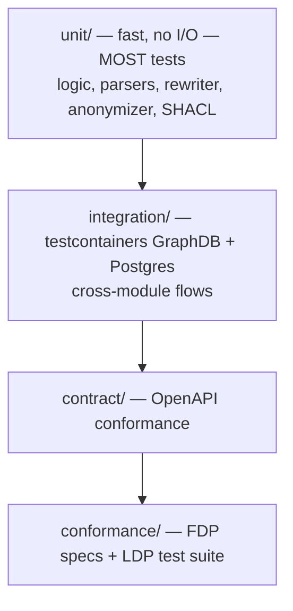
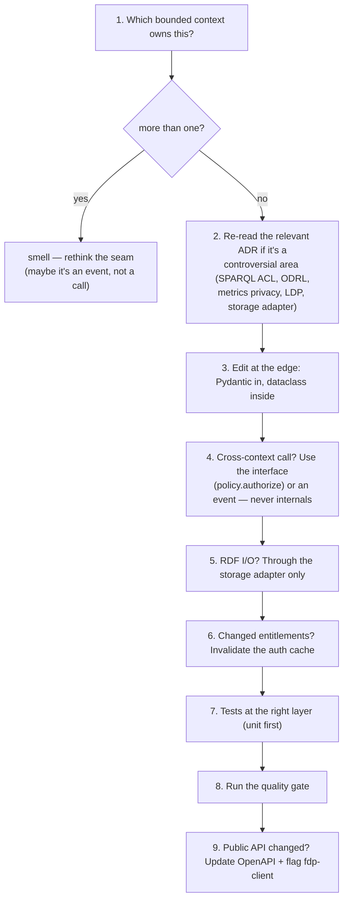

# 7. Contributing

You've read the architecture. This document gets you from a clone to a merged PR: environment, the quality gate, the testing pyramid, and a worked example of adding a feature without breaking a boundary.

← [Data model](06-data-model.md) · [Back to index](README.md)

---

## 7.1 Local environment

```bash
# 1. Bring up the dev stack (triple store, Postgres, Keycloak)
docker compose -f deploy/compose.yaml up -d

# 2. Install / sync dependencies (uv, not pip)
uv sync

# 3. Run migrations
uv run alembic upgrade head

# 4. Apply the default profile (or rely on first-boot auto-bootstrap)
uv run fdp profile apply ./profiles/default

# 5. Start the API in dev mode (auto-reload)
uv run fastapi dev src/fdp/main.py
```

Sanity checks once it's up (remember the `/fdp-api` prefix — [doc 4](04-request-lifecycle.md)):

```bash
curl -s http://127.0.0.1:8000/fdp-api/healthz                 # liveness
curl -s http://127.0.0.1:8000/ -H 'Accept: text/turtle'        # root FDP record
curl -s http://127.0.0.1:8000/fdp-api/catalog/spec -H 'Accept: text/turtle'  # composed catalog shape
open http://127.0.0.1:8000/fdp-api/docs                        # Swagger UI
```

## 7.2 The quality gate

Run this before declaring any change done. CI runs the same thing.

```bash
uv run ruff check . && uv run ruff format --check . \
  && uv run pyright \
  && uv run pytest
```

- **ruff** — lint + format. isort-ordered imports (stdlib, third-party, first-party).
- **pyright** — strict mode. No bare `Any` without a justifying comment.
- **pytest** — the full suite.

If you change the public HTTP API, the **OpenAPI spec must update**, and the `fdp-client` repository needs a coordinated change to regenerate its types. Flag this in your PR.

## 7.3 The testing pyramid



Rules:

- **Default to unit tests.** They're fast and carry most of the coverage. Logic that can be tested without I/O *should* be.
- **Integration tests use testcontainers** to launch a real triple store and Postgres. Use them for genuine cross-module flows (a write that must land in the store, an access decision against real graphs). Don't put slow tests in the unit suite.
- **The two highest-risk areas — the SPARQL rewriter and the auth cache — deserve adversarial tests.** If you touch [access/rewriter.py](../../src/fdp/access/rewriter.py) or [policy/cache.py](../../src/fdp/policy/cache.py), add tests that try to break isolation, not just the happy path. A bug here is a data-disclosure bug.
- Run a slice while iterating: `uv run pytest tests/unit/access`, or `uv run pytest -k policy`.

## 7.4 How to add a feature without breaking a boundary

A checklist that mirrors how a reviewer will read your PR:



### Worked example: "expose a new metadata type (`Ontology`)"

You do **not** edit routers or re-bootstrap. Per [ADR-0009](../adr/0009-runtime-resource-definitions.md):

1. **Publish the shape**: `PUT /fdp-api/schemas/ontology` with a SHACL `NodeShape` (compose the base with `sh:node` if it's a DCAT subtype — see [doc 5 §5](05-key-processes.md#5-schema-composition-and-validation)).
2. **Register the resource definition** via the RD admin API: a `urlPrefix`, the shape IRI, and where it sits in the hierarchy.
3. The LDP container registry and OpenAPI surface **light up live** — `/{prefix}`, `/fdp-api/{prefix}/spec`, `/fdp-api/{prefix}/page/{child}` — because the router reads the RD cache per request and the OpenAPI injector rebuilds lazily.

No restart, no router code, no re-bootstrap. That's the system working as designed.

## 7.5 What not to do (the high-frequency review rejections)

- Don't **bypass the LDP layer** for record CRUD — you'll skip SHACL validation, meta-metadata, membership, and events.
- Don't **evaluate ODRL** anywhere but `policy` — call `policy.authorize`.
- Don't **store identity in metrics** — the anonymization boundary is structural ([doc 5 §8](05-key-processes.md#8-metrics-anonymization)).
- Don't **call the triple store outside the adapter**, and don't use a vendor-specific API — capabilities sit behind flags.
- Don't **f-string into SPARQL or SQL** — parse/parameterize.
- Don't **add a runtime dependency** without justification — the dep set is intentionally conservative.
- Don't **add to `shared`** unless it genuinely crosses contexts.

## 7.6 Commits and PRs

- Branch off `main`; don't commit straight to it.
- Keep the change inside one bounded context where you can. A PR that edits five contexts is usually a boundary smell.
- If you hit a gap the docs/ADRs don't cover, document the choice in the PR and consider whether it warrants a new ADR (the architecture doc §15 tracks open questions).
- The architecture doc and ADRs are authoritative. If code disagrees with them, follow the docs and flag the discrepancy rather than quietly diverging.

## 7.7 Where to go deeper

- **The formal architecture**: [docs/architecture/README.md](../architecture/README.md) — 15 sections.
- **The "why" behind hard choices**: [docs/adr/](../adr/) — 14 ADRs.
- **Roadmap / known gaps**: [docs/nextstepssuggestions.md](../nextstepssuggestions.md) and architecture §15.
- **Project conventions, in brief**: [CLAUDE.md](../../CLAUDE.md).

Welcome aboard.

---

← [Data model](06-data-model.md) · [Back to index](README.md)
